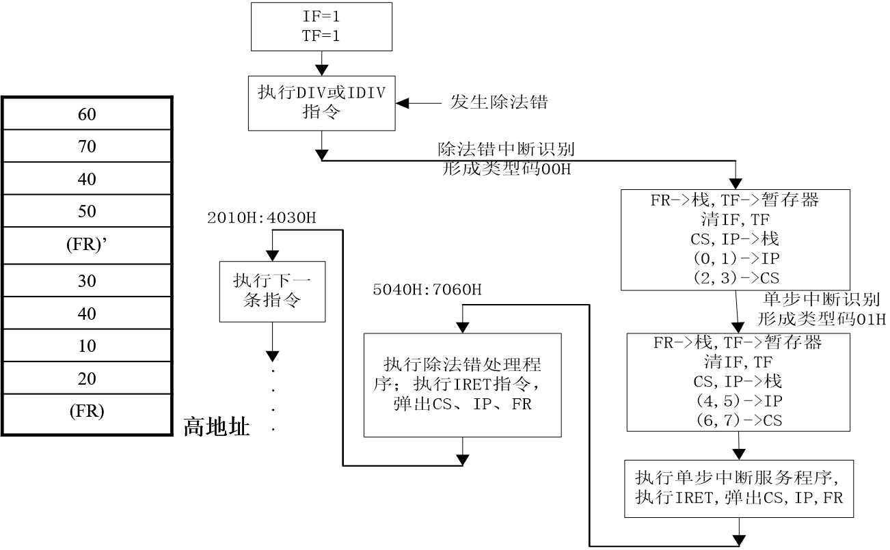
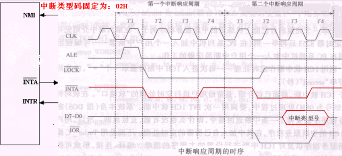

# IO
## IO电路的意义
IO是计算机计算和处理能力的外在体现，但外部设备种类繁多，且速度差异很大，信号形式和信息格式大不相同，所以中间需要IO接口电路进行转换。IO接口电路是CPU与外部设备之间实现信息交流的控制电路，完成CPU与外部储存器之间的适配。
## 作用
* 对输入/输出数据进行缓冲，隔离和锁存
* 对信号的形式和数据格式进行匹配
* 提供信号交换的应答联络信号，进行时序匹配
* 进行地址译码，根据地址信息选择相应的设备
* 提供可编程功能
## 交换的信息
* 数据信息
* 状态信息
* 控制信息
## 分类
### 数据传输方式
* 并行
* 串行
### 通用性
* 通用
* 专用
### 功能灵活性
* 可编程
* 不可编程
## IO端口
每个端口用分配一个端口地址进行区分
### 分类
* 数据：数据端口是用来存放外设送往CPU或CPU输出到外设去的数据。
* 控制：指示外设的当前状态
* 状态：用来存放CPU向接口发出的各种命令和控制字
* 都使用数据总线传输
### 编址方式
独立编址/统一编址
## 译码
高位选中，低位指示内部寄存器
## 数据传送方式
### 程序直接控制传送：低速外设
* 无条件传送方式：设备需时刻处于就绪状态
* 程序查询传送：CPU轮询外设进行数据交换
### 中断控制传送：中低俗外设
IO设备中断CPU的工作使CPU暂停当前的程序，去执行外设IO，包括中断请求，中断判断，中断响应，中断处理，中断返回，现场保护，现场恢复
### DMA控制传送，用于高速外设
在内存与外设之间建立直接的数据通路，利用DMA控制器管理总线进行数据传送，器件CPU需要让出总线控制权
* 需要硬件支持

# INT
## 定义
* 中断：当CPU检测到中断请求时，CPU停止执行当前程序，转去处理相应的事件，完成后再返回源程序停止的地方继续运行，这种程序控制方式称为中断方式
* 中断源：能发出中断申请的事件称为中断源，处理器内部中断源叫内中断，外部的叫外中断
* 外部中断：一般IO，主板故障，DMA，CLK
* 内部中断：除法错误，INT n
## 中断过程
1. 中断请求
2. 中断源识别
3. 中断响应
4. 断电保护
5. 现场保护
6. 中断服务
7. 现场恢复
8. 中断返回
## 中断优先级
低优先级的中断能被高等级中断源再次中断
### 判断方法
#### 软件查询
中断优先级由查询顺序决定，先查询的中断源具有高优先级
#### 简单硬件
菊花链：在物理上排在前面的优先级高
#### 专用控制芯片
## 中断源
### 内部中断
* 除法：CPU本身产生
* 单步：TF=1，服务前TF=0，服务后TF=1
* 断点：INT3
* 溢出：INTO，OF=1
* 软件：ROM BIOS和DOS中断调用
#### 特点
* 矢量号由CPU提供，无需总线读入
* 除单步中断外，其他都无法禁止
* 除单步中断外，内中断优先级高于外中断
### 外部中断
* 非屏蔽中断（NMI）：不受IF控制
* 可屏蔽中断（INTR）：从INTR引入
## 中断向量表
256个中断服务程序的入口地址存放在内存的00000H-003FFH中，每个向量四个字节，两个偏移地址，两个段地址 
e.g:中断类型号:3 
位置：0000CH-0000F，服务地址1EA00H=1E00:0A00H 
|Addr|Data|
|---|---|
|0000:000CH|00|
|0000:000DH|0A|
|0000:000EH|00|
|0000:000FH|1E|

## 编写中断处理程序
### 操作中断向量表
* AL=n, AH=35H, INT 21H
* AL=n, AH=25H, INT 21H
### 中断服务程序流程
* 保护现场（FR，CS，IP入栈）
* 开中断，允许中断嵌套
* 中断处理（尽可能短）
* 向8259发送中断结束命令
* 关中断，恢复现场
* 开中断，返回
# 8259
* CPU自行管理内部中断
* NMI有固定中断号
* 使用8259管理外部可屏蔽中断
## 时序图

## 芯片特性
* 单片管理8级中断
* 每级中断都可以屏蔽或允许
* 在每个响应周期向CPU提供中断类型码
* 具有多种中断管理模式
## 级联
* 主片INT接CPUINTR，从片INT接IR
* INTA都连到一起
* 数据总线也都连在一起
* CAS0-2连在一起
* 主片SP接Vcc，从片SP接地
## 工作方式
### 中断触发方式
* 边沿触发
* 电平触发
* 需要注意高电平保持时间
### 中断嵌套方式
* 一般全嵌套：只有高优先级可以中断低优先级
* 特殊全嵌套：允许同级嵌套
### 中断优先级管理方式
* 固定优先级：IR0最高，IR7最低
* 优先级自动循环：触发后，该中断降至最低优先级，其他优先级循环处理，相对于等优先权方式
* 优先级特殊循环方式：可以设置起始队列的优先级自动循环方式
### 中断屏蔽方式
* 普通屏蔽：IMR中相应位置1，屏蔽相应中断
* 特殊屏蔽：仅屏蔽本级中断，可响应高级或低级的中断请求，将IMR中相应位置“1” 的同时，清ISR相应位
### 中断结束方式
* 普通中断结束方式：CPU中断服务结束前，向8259A发送‘常规中断结束’命令字，清除ISR中优先级别最高的置位
* 自动中断结束方式：8259在第二个INTA响应脉冲后，自动执行普通中断结束
* 特殊中断结束方式：CPU发特殊命令字，指明复位的是哪一位
