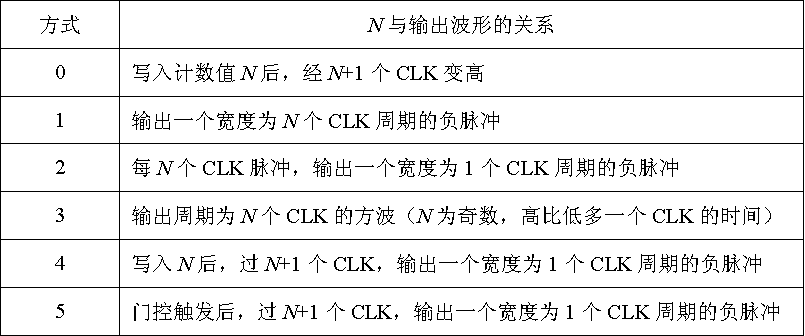
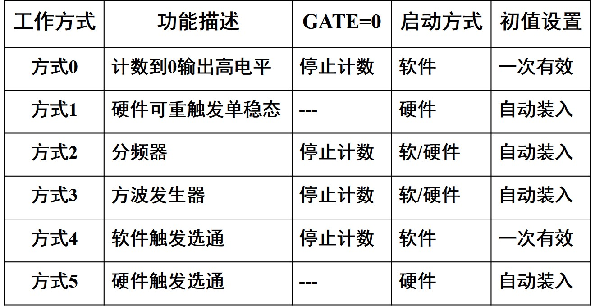
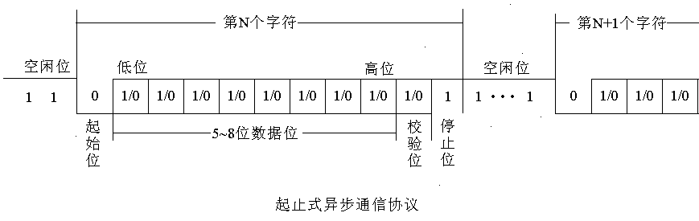
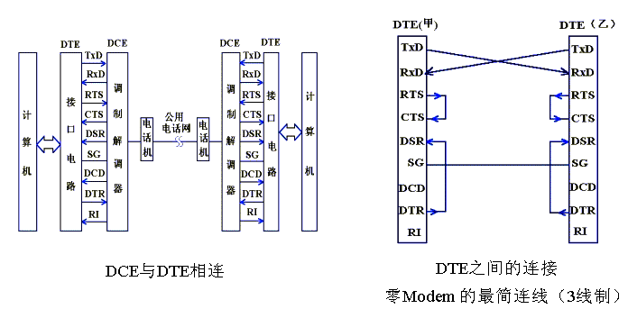
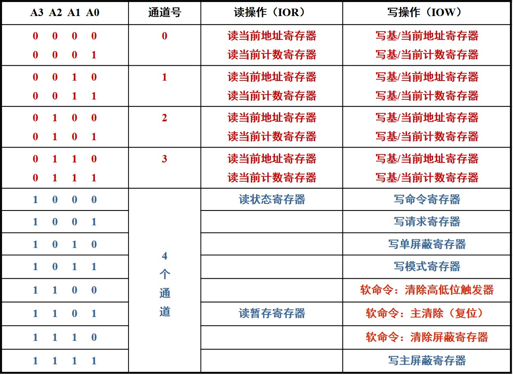

# 8255A
## 工作方式
### 方式0
* ABC可以设定为数据输入或输出，都是单向无条件传输。
* 输出锁存，输入缓冲，但不锁存
* 没有联络线
### 方式1
* AB作为数据口，单向输入/输出，C口作为应答线或用于数据传输
* AB都具有锁存能力
* 用于中断方式和程序查询方式下的数据传输
### 方式2
* A支持数据双向传输，IO分时复用，C口作为联络线或数据传输，B口工作在0或1
* 用于中断方式和程序查询方式下的数据传输
## 具体时序
### 方式1和方式2的C口用法
# 8253
* 三个独立16位计数通道
* 二进制/十进制(BCD码)计数
* 计数速率2MHz
* 每个通道有六种工作方式
## 初始化
* 先送控制字，再写计数初值
* 只写低八位，高八位为0，RW=01
* 只写高八位，低八位为0，RW=10
* 16位初值，先写低八位，再写高八位，RW=11
## 初值范围
* 二进制：1-65536(0001H-0000H)
* BCD：1-10000(0001H-0000H)
## 读写
* 只允许读计数值，不允许读控制字
* 读取过程：先向控制器写锁存命令，再读，所以一共有写命令字一次，计数器到输出电路读一次，输出电路到CPU再读一次。读完后，锁存自动结束
## 工作方式
### 初始化
先写控制字，再写计数值，写入后需要一个周期才被装入计数寄存器，之后进行减一计数
#### 装入方法
* 一次有效装入
* 自动重复装入
#### 启动方式
* 软件启动：初值写入后，开始计数（GATE有效）
* 硬件启动：门控信号上升沿启动计数过程
#### 方式0：计数器
* 写控制字，输出0，计数结束输出1
* 写入N但实际需要N+1个上升沿才会输出1
* 软件启动，一次装入
#### 方式1：可编程单稳态触发器
* 硬件启动，自动装入
* 写入控制字，out=1，gate上升沿，经过一个clk后out=0，计数结束out=1，等待gate上升沿
* 负脉冲宽度，N个CLK周期
* 计数过程中，GATE上升沿可再次触发
* 计数过程中写入初值，下次触发有效
#### 方式2：N分频器
* 软件启动，自动装入
* 计数值为1，out=0，其余时刻，out=1
* 每输入N-1个CLK，输出一个宽为1CLK的负脉冲
* GATE=0，暂停计数，out=1,GATE变为1，重新计数
* 计数中写入，下次计数有效
#### 方式3：方波发生器
* 软件启动，自动装填
* 写入时刻out=1，计数值小于N/2，out=0，其余时刻，out=1.
* Gate=0，暂停，Gate=1，恢复初值重新计数
* 写入新的初值，在后半周期（低电平）计数开始时有效
#### 方式4：软件触发选通
* 软件启动，一次装入
* 计数结束，保持一个clk的out=0，其余时刻，out=1
* 可随时写入新的初始值，经过一个CLK后，使用新数字计数
#### 方式5：硬件触发选通
* 硬件启动，自动装填
* 计数结束，保持一个clk的out=0，其余时刻，out=1
* 写入新初始值，下次触发有效
## 一些图
###### 预置值N与输出波形关系图

###### 工作方式图

# 8251
## 通信方式
* 并行通信，适用于计算机与近端外设间的通信
* 串行通信，一个一个symbol分时传输，速度慢，远端通信
## 同步
* 同步是指接收端按照发送端所发信息单元的重复频率和起止时间来接收数据，即收发双方在时间基准上应保持一致
* 码元同步：接收端和发射端，每一个symbol都精准同步
### 基本协议
* 面向bit
* 面向字符型
### 要求
* 时钟严格同步
* 近距用时钟线，远距用差分编码
### 帧同步
* 内同步：帧同步信息包含在发送的数据信息中（单同步/双同步）
* 外同步：用外部同步脉冲指示数据开始
## 异步
* 特点：时钟不需要保持严格同步
### 基本协议
1. 起始位低电平
2. 5-8个数据位（先传最低位）
3. 校验位（可选）
4. 停止位高电平
5. 空闲位

### 时钟
* 发射端Tc和接收端Rc时钟频率相同，而信息位宽度为收发时钟的n倍
* 接收方在每个上升沿进行采样，连续8个低电平，接收到起始位
* 以该时刻为基准，每16Rc进行一次采样，即每个信息中点采样
### 波特率
* 每秒传输的符号数，单位buad
* 常见波特率：9600，19200，115200
* 波特率因子，发送时钟和接收时钟为波特率的倍数（16，32，64），一般取16
## 调制与解调
## 串行通信物理标准
* 数据中断设备(DTE)和调制解调器MODEM(DCE)之间的标准
### RS232C
#### 引脚定义
|引脚|作用|方向|
|:---:|:---:|:---:|
|TxD|DTE发送|O|
|RxD|DTE接收|I|
|RTS|DTE请求发送|O|
|CTS|DCE允许发送|I|
|DTR|DTE准备好|O|
|DSR|DCE准备好|I|
|DCD|DCD载波检测|I|
|RI|DCE振铃指示|I|
|SG|地|None|
#### 连接示意图

## 8251基本功能
* 通用同步异步收发，全双工，双缓冲
* 异步，同步通信支持
* 差错检测
## 引脚
### CPU端
* D7-D0：数据IO
* RESET
* CS
* C//D：端口选择
* RD
* WR
* CLK
### 调制解调器端
* RTS
* CTS
* DTR
* DSR
### 收/发控制
* TxC：发送时钟
* RxC：接收时钟
* TxRDY
* RxRDY
* TxE：发送器空闲
* SYNDET：同步检出
* RxD：发送数据
* TxD：接收数据
## 工作方式
### 异步
* 发送：TxEN=1，CTS=0
* 接收：RxE=1
### 同步
* 发送：TxEN=1，CTS=0
* 接收：RxE=1
* 内同步：自动搜索同步字符
* 外同步：借助SYNDET信号线
## 编程
### 初始化
先送三个0，再送一个40H
```
MOV DX,2B9H
MOV AL,0
OUT DX,AL
OUT DX,AL
OUT DX,AL
MOV AL,40H
OUT DX,AL
```
# 8237
* DMA适用于高速外设和存储器间大量数据传输
* 也可用于存储器和存储器的传输，或IO到IO的传输
* 由DMAC控制
## 基本过程
* DMAC接受外设DMA请求
* 向CPU发出总线 请求
* CPU发出总线响应，接管总线
* 向外设发送DMA应答
* 进行数据传输
> * 给出存储器地址
> * 给出IO接口及存储器的控制字
> * 对传送的字节数进行计数

* 传输结束，向CPU交还总线
## 工作方式
### 传输方式
* 单字节传送：每次DMA请求只传送一个字节，当前地址和字节自动修改，下次DMA请求继续传送，DMAC和CPU轮流控制总线，结束输出EOP
* 数据块传送：连续传送一个数据块，数据传输效率高，但会持续占用总线，结束后输出EOP，EOP有效则传输结束
* 请求传输：但DREQ=0时，暂停传输，结束后EOP有效，EOP有效强制终止DMA传送
* 级联方式：用于扩展DMA通道
### 传送类型
* IO到MEM：IOR->BUS，MEMW->存储器
* MEM到IO：MEMR->BUS,IOW->IO
* MEM到MEM（使用通道0和1）：MEMR->BUS->内部暂存器->BUS->MEMW
### 优先级
* 固定优先级：静态，通道0最高，3最低
* 循环优先级：动态，最近被服务过的最低，紧跟其后的最高
## 编程

### 样例
需求：外设输入通道0，16K字节，块传输，内存8000H，不自动初始化，DMAC起始位置70H
```
OUT 7DH,AL ;RESET
MOV AL,00H
OUT 70H,AL;LOW ADDR
MOV AL,80H
OUT 70H,AL;HIGH ADDR
MOV AL,00H
OUT 71H,AL;LOW COUNTER
MOV AL,40H
OUT 71H,AL;HIGH COUNTER
MOV AL,10000100B
OUT 7BH,AL;MODE
MOV AL,10100000
OUT 78H,AL;COMMAND
MOV AL,00H
OUT 7AH,AL;FORBIDDEN REG
```
需求：存储器地址6000H:0000H，单字节，32字节，增量，不自动预制，DMAC端口地址00H-0FH，页面寄存器83H，通道1
```
OUT OCH,AL; CLEAR FLAGS
MOV AL,01000101B
OUT 0BH,AL;MODE
MOV AL,06H
OUT 83H,AL;PAGE REG
MOV AL,00H;
OUT 02H,AL;LOW ADDR
MOV AL,00H;
OUT 02H,AL;HIGH ADDR
MOV AL,1FH
OUT 03H,AL;LOW COUNTER
MOV AL,00H
OUT 03H,AL;HIGH COUNTER
MOV AL,00000001B
OUT OAH,AL;FORBIDDEN REG
```
