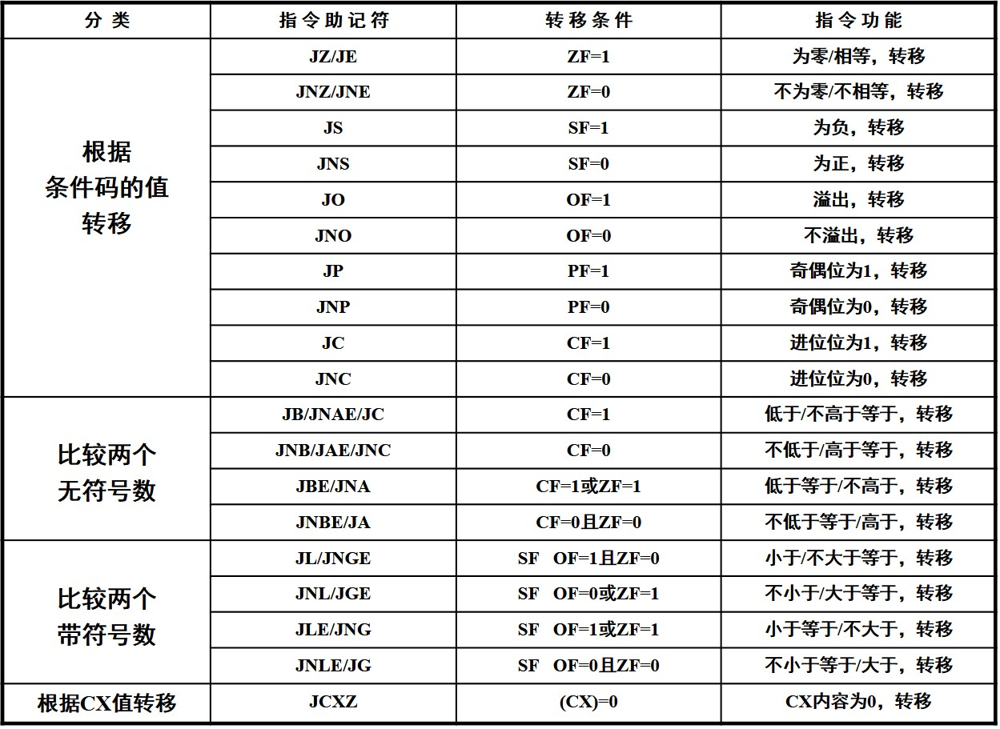

# 指令系统
## 寻址
* 操作数寻址
* 指令寻址
### 操作数类型及寻址
* 立即操作数：包含在指令中，跟随在操作码之后
> 立即寻址

* 寄存器操作数：存放在内部寄存器中
> 寄存器寻址

* 存储器操作数：存放在存储器中
> 直接寻址，寄存器间接寻址，寄存器相对寻址，基址变址寻址，相对基址变址寻址

* IO端口操作数：存放在IO接口电路的相应端口
> 端口寻址

### 寻址方式
#### 立即寻址
MOV AX,0102H
#### 寄存器寻址
MOV AX,BX
#### 直接寻址
MOV AX,ES:[2000H] 
MOV AX,[2000H]
#### 寄存器间接寻址
MOV AX,[SI] 
MOV AX,DS:[SI]
#### 寄存器相对寻址
* 相对基址寻址:MOV AL,[BX+10H]//BX和BP
* 相对变址寻址:MOV AL,[DI+1000H]//SI和DI
* BP是SS段，其他为DS
#### 基址变址寻址
* 由基址寄存器和变址寄存器相加
* MOV AL,\[BX\]\[SI\]=MOV AL,[BX+SI]
* 由BX(DS)和BP(SS)决定段寄存器
#### 相对基址变址寻址
* MOV AL,20H\[BX\]\[SI\]=MOV AL,[BX+SI+20H]
* 由BX和BP决定段寄存器
#### 端口寻址
##### 直接寻址
* 范围0-FFH
* IN AL,20H
##### 间接寻址
* 范围0-FFFFH
* IN DX,AL
* IN AX,DX
### 指令寻址
#### 段内直接寻址
代码直接给出转移地址到IP(一般不用)
#### 段内间接寻址
转向地址由数据寻址方式给出新IP
#### 段内直接寻址
指令中直接给出CS和IP
#### 段间间接寻址
由数据寻址方式给出CS和IP
## 指令系统
### 数据传送指令
#### MOV，通用数据转移
* MOV dst,src
* 常量不能被赋值
* 不能改CS
* 不能从段寄存器到段寄存器
* 不能直接将立即数传到段寄存器
#### XCHG，交换
* XCHG OP1,OP2
* 长度必须一直
* 不能在寄存器之间交换
* 不能交换段寄存器
#### XLAT，换码
将DS:[BX+AL]处的值赋给AL
#### LEA，地址传送
* LEA reg,mem
* src必须为储存器
* reg不能为段寄存器
#### PUSH/POP
* 字操作
* 不能pop到CS和常量
#### IN/OUT
* IN AL,port
* OUT port,AL
### 算术运算指令
#### ADD/ADC
* ADD/ADC dst,src
* ADD:dst=src+dst
* ADC:dst=src+dst+CF
#### SUB/SBB
* SUB/SBB dst,src
* SUB:dst=dst-src
* SBB dst=dst-src-CF
#### INC/DEC
* 不影响CF，其他都影响
#### CMP
* CMP opr1，opr2
* 计算opr1-opr2
* 不能同时为存储器操作数
#### DAA/DAS
* DAA/DAS:加法/减法BCD调整
* 只能用于加减计算之后
* 不影响OF，其他都影响
### 逻辑运算和移位指令
#### 常用逻辑操作
* AND,OR,XOR,NOT
* TEST opr1,opr2=opr1 AND opr2但只改变标志寄存器
* NOT不影响标志位
* 其他影响SF，ZF和PF，CF=OF=0，AF未定义
#### 移位指令
##### SHL,SHR,SAL,SAR
* SHL/SHR dst,cnt
* cnt可为立即数1或由CL决定
* SHL，SHR和SAL影响标志位CF和OF
* 对于SHL和SAL，若CF发生改变，则OF=1
* SHR，OF=移位前的最高位
* SAR，影响标志位CF，OF，PF，SF，ZF。AF未定义
* SHL，SAL和SHR用0补全
* SAR用最高位补全
##### ROL，ROR，RCL，RCR
* 在ROL/ROR中CF为移出位，且用移出位补全
* 在RCL/RCR中CF为移出位，且用CF补全
### 串操作指令
* 用于连续字符串的赋值
* 源串在DS:[SI]中，可以段超越，目的串在ES:[DI]中，不能段超越
* 方向设置指令，CLD(增量)，STD(减量)
* CX决定重复次数
#### MOVSB/MOVSW
* MOVSB/MOVSW:字节/字传送
#### STOSB/STOSW
* STOSB/STOSW:储存AL/AX的值
#### LODSB/LODSW
* LODSB/LODSW:读数据到AL/AX
#### CMPSB/CMPSW
* 串元素比较
### 控制转移指令
#### 无条件转移
* JMP SHORT label:段内直接端转移
* JMP NEAR PTR label:段内直接近转移
* JMP reg:段内间接转移指令
* JMP WORD PTR src:段内间接转移指令
* JMP FAR PTR label:段间直接转移指令
* JMP DWORD PTR src:段间间接转移指令
#### 条件转移

#### 循环控制指令
* LOOP label:若CX不为0，跳转到label处
* LOOPZ/LOOPE label:若ZF=1且CX不为0，跳转到label
* LOOPNZ/LOOPNE label:若ZF=0且CX不为0，则跳转到label
#### 函数调用
* CALL sub:段内调用函数sub
* CALL FAR PTR sub:段间调用sub
* CALL DWORD PTR src:段间间接调用
* RET:函数返回，只恢复IP和CS
* INT n:调用中断向量
* IRET:恢复IP，CS，FLAGS
### 处理器控制指令
#### 标志位
* CLC/STC:CF置0/1
* CMC:CF求反
* CLD/STD:DF置0/1
* CLI/STI:IF置0/1
