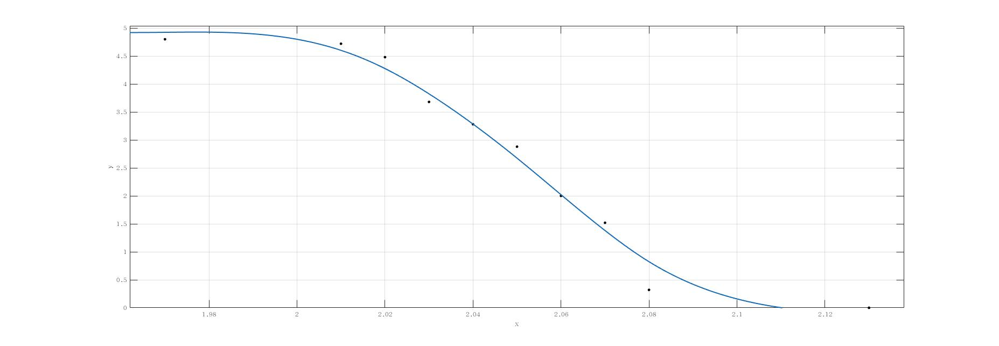

# 实验一 逻辑门电路测试之一

 实验人:杨庆龙 学号：1500012956
 实验日期:2017.9.25
 报告提交日期:2017.9.27

## 实验目的
1. 了解门电路的基本特性，并理解各参量的实际物理意义，注意实际门电路和理想门电路的不同
2. 理解不同类型门电路的异同
3. 了解示波器在电路特性测量中的应用，提升使用熟练度

## 实验原理
### 输入短路电流$I_{rd}$
空载时，一个输入端接地，其他输入端悬空后，流经接地输入端的电流大小。
### 输入交叉漏电流$I_{rj1}$
空载时，一个输入端接$V_{cc}$ ，其他输入端全部接地，流经高电平输入端的电流大小。即门电路从信号源吸收电流的最大值。
### 输入端上阈值电压$V_s$和下阈值电压$V_x$
两者均为门电路带额定负载时的情况
* 上阈值电压:使输出电压为逻辑低电平0.35V时的最低输入电压
* 下阈值电压:使输出电压为逻辑高电平2.7V时的最高输入电压
### 输出高电平$V_{OH}$ 和输出低电平$V_{OL}$
两者均为门电路带额定负载时的情况
* $V_{OH}$ :输入电压为逻辑低电平0.8V时的输出电压
* $V_{OL}$ :输入电压为逻辑高电平2V时的输出电压
### 上阈值电阻$R_s$和下阈值电阻$R_x$
输入端对地串接一个电阻R
* 上阈值电阻:当输出电压为逻辑低电平时所允许的R的最小值
* 下阈值电阻:当输出电压为逻辑高电平时所允许的R的最大值
### 空载功耗与有载功耗
* 空载功耗:没有外部负载时，电路消耗的电功率(输入端开路/输入端短路)
* 有载功耗:接有外部负载时，电路消耗的电功率

## 实验仪器和设备
* 双通道示波器：一台
* 信号源：一台
* 双路稳压电源：一台
* 电烙铁：一台
* 74LS00与非门：一片
* CD4011与非门：一片

## 实验步骤和方法
1. 静态参数 
(1）在输入端串联一个小电阻(100欧)，再换算出流经小电阻上的电流 
(2) 测量输入端的$V_s,V_x,V_{OH},V_{OL}$ 
输入频率为100Hz，电压幅度为0-5V的三角波，通过输入输出电压的波形比较，测出我们所需要电压。 
(3) 测量$R_s,R_x$ 
(4) 测量输入端为高电平和低电平时，门电路的空载功耗与有载功耗(注意去除负载上的功耗) 
(5) 测量动态功耗，负载为其余三个门的并联
(6) 测量CD4011的(4)(5)
(7) 测量74HC00的(4)(5)

2. 观察输入输出电压传输特性
(1)输入信号分别为100Hz与100kHz的0-5V的三角波。记录两种测试电路下，输入端为输入阈值电压时，电压传输特性曲线的变化，注意阈值的变化，解释现象，并说明原因。
(2)用DTL的74LS00再做一次，并比较

3. 估测门的延迟 
输入频率为100kHz的方波，记录输入输出电压的波形，估算平均延迟时间。

## 实验结果
1. 静态参数 

(1) 输入短路电流 $I_{rd}$ 
输入端串联小电阻阻值:99.6Ω，工作电压 $V_{cc}$：4.98V 

###### 输入短路电流数据记录表

|编号|V|$I_{rd}$|
|:--:|:--:|:--:|
|1|22.0mV|0.221mA|
|2|21.6mV|0.217mA|

从表中可以看到输入端会有一个约为0.2mA的电流从中流出。这也就意味着，前级驱动电路起码需要有0.2mA的输出电流才能带动74LS00逻辑门。我们也可以通过这个数值，估算出相应电路的扇出能力，以供设计电路时作为参考。

(2) $V_x,V_s,V_{OH},V_{OL}$

74LS00工作电压:4.98V 
CD4011工作电压:5.12V

74LS00的 $V_{OH}$ 为3.50V， $V_{OL}$ 为0.250V。

测量结果与理论上74LS00的输出特性相近，满足$V_{OH}$ 高于逻辑输出高电平，$V_{OL}$ 低于逻辑输出低电平的性能要求。
###### 上下阈值电压数据记录表

|编号| $V_s$|$V_x$|备注|
|:--:|:--:|:--:|:--:|
|1|1.14V|0.702V|74LS00输入引脚1|
|2|1.20V|0.796V|74LS00输入引脚2|
|3|2.00V|2.32V|CD4011两端输入，信号频率100KHz|
|4|2.00V|2.40V|CD4011单端输入，信号频率100KHz|
|5|2.08V|2.26V|CD4011双端输入，信号频率100Hz|
|6|2.22V|2.32V|CD4011单端输入，信号频率100Hz|

对于输入引脚1，其$V_x$ 太过临界，可能是是逻辑门本身的性能不够好，或者是在测量时电路接触不良，导致$V_{cc}$ 大大低于5V的工作需要，导致$V_x$ 偏小。测量结果即要求了前级电路的输出电压，只有前级输出电压达到相应的要求，我们才能保证系统工作在预想中的状态。 
对于CD4011，可以看到，输入信号的频率不同，数值上略有差异，初步分析认为，逻辑门的输入端可看作并联了一个小电容，导致逻辑门对于不同频率信号的响应也就不一样。其对于高频信号的影响大于低频信号的印象，也就导致表格中输入100Hz信号和100KHz信号有着不一样的结果。 
至于单端输入与双端输入，其对于门电路工作有一定的影响，又考虑到双端输入需要前级电路输入两倍的电流，却对电路的正常工作并没有十分显著的影响。因此，当逻辑门的某一输入端电平可以固定时，优先考虑使用单端输入的连接方式，从而减轻前级电路的负载。

(3) $R_x,R_s$ 
工作点$V_{cc}$:4.98V 

对于74LS00芯片，经过测量得到$R_x$ 为7.2KΩ，此时$V_{in}$ 为2.9V。又测得，$R_s$ 为8.3KΩ，$V_{in}$ 为0.17V。 
这两个电阻值，分别代表了要使输入引脚到达逻辑高/低电平所需要的电阻的最大值与最小值。我们可以通过这两个测量数据，再加上一些余量，即可较为方便节能地将逻辑门某一输入引脚固定在某一逻辑电平，为我们设计电子系统时提供便利。

(4) 静态功耗

测量时工作电压：4.98V 
###### 门电路静态功耗测量数据记录表

|编号|电压|电阻阻值|种类|负载|输入电平|
|:-:|:-:|:-:|:-:|:-:|:-:|:-:|
|1|54.3mV|20.0Ω|74LS00|空载|高电平|
|2|35.3mV|20.0Ω|74LS00|空载|低电平|
|3|44.6mV|20.0Ω|74LS00|有载|高电平|
|4|45.3mV|20.0Ω|74LS00|有载|低电平|
|5|<1mV|99.5kΩ|CD4011|空载|高电平|
|6|<1mV|99.5kΩ|CD4011|空载|低电平|
|7|<0.1mV|99.5kΩ|CD4011|有载|高电平|
|8|<0.1mV|99.5kΩ|CD4011|有载|低电平|

从原始数据记录表格中我们可以计算得知

###### 门电路静态功耗计算数据记录表

|种类|输入电平|负载|功耗|
|:-:|:-:|:-:|:-:|
|74LS00|高电平|空载|3.38mW|
|74LS00|低电平|空载|2.20mW|
|74LS00|高电平|有载|4.51mW|
|74LS00|低电平|有载|1.14mW|
|CD4011|高电平|空载|<2nW|
|CD4011|低电平|空载|<2nW|
|CD4011|高电平|有载|<0.2nW|
|CD4011|低电平|有载|<0.2nW|

从表中我们可以看到，实验中选用的74LS00型与非门虽然已经是当时比较节能的门电路了，但与CD4011相比较而言还是比较耗能的。初步分析认为，TTL型的门电路，即使没有负载，也会有一定大小的电流从$V_{cc}$ 漏到地，也就导致其在静态工作状态下也会有一定大小的功耗。而对于CMOS型的门电路，由于其几乎没有漏电流的出现，也就导致其静态工作状态几乎没有功耗，相当节能。 
由于CD4011在静态工作状态下功耗实在太小，记录到的数据有效性也相当有限，所以主要分析74LS00的静态功耗。 
从表中可以看出，在空载与有载状态下，均出现了输入高电平时的功耗更大的情况，这可以从74LS00的结构图中得到答案。当两个输入端均为高电平时，三极管导通，虽然输出端悬空，但还是会有不小的电流流经内部电阻，产生耗能。而当输入端为低电平时，三极管不导通，虽然还是有少量电流流经内部电阻，但已经大大减小，因此出现输入高电平时的功耗大于输入低电平时的功耗的情况。 
又可以看到，在有载的情况下，输入电平的高低对电路功耗的影响变大了。初步分析得到的结论如下，当输入高电平时，输出的是低电平，本来三极管在此时就处于导通状态，又由于源极电阻变小，电流变大，相应地，功耗也就变大。而输入为低电平时，输出高电平，再加之负载会有少量的漏电流流回该电路，使得流经三极管的电流不变的情况下，流经电阻的电流变小了，进而导致门电路功耗变小。

(5)动态功耗 
74LS00工作电压:4.98V 
CD4011工作电压:5.20V 

###### 动态功耗实验数据记录表
|编号|种类|频率|电压|电阻值/Ω|功率|
|:-:|:-:|:-:|:-:|:-:|:-:|
|1|74LS00|1kHz|38.4mV|20.0|2.39mW|
|2|74LS00|100kHz|38.7mV|20.0|2.41mW|
|3|74LS00|1MHz|51.0mV|20.0|3.17mW|
|4|CD4011|1kHz|0.251mV|510|0.640μW|
|5|CD4011|100kHz|20.5mV|510|52.3μW|
|6|CD4011|1MHz|195mV|510|0.500mW|

从表中可以看到，74LS00的功耗虽然有随着频率的增大而增大，但一直都和静态功耗一个水平，这也就意味着，在频率不是非常大的情况下，74LS00的动态功耗几乎是由静态功耗决定的。 
而对于CD4011而言，由于其静态功耗实在太小，所以其动态功耗很明显地呈现出与频率成正比的关系，即，信号频率每增大一个数量级，功耗也增大一个数量级，上升得十分迅速。 
从74LS00和CD4011的动态功耗变化趋势可以看出，对于工作频率不是很高的情况，使用CD4011比74LS00节能很多。但又考虑到74LS00的功率增长速度远远低于CD4011，若该规律能在更高的频率下也可行的话，在高于一定工作频率的系统下，使用74LS00会成为更加节能的选择。

(6)$V_i V_o$特性曲线 

######$V_i V_o$特性数据记录表
|$V_i$/V|$V_o$/V|$V_i$/V|$V_o$/V|
|:-:|:-:|:-:|:-:|
|0.00|4.8|2.05|2.88|
|2.01|4.72|2.06|2.00|
|2.02|4.48|2.07|1.52|
|2.03|3.68|2.08|0.320|
|2.04|3.28|4.98|<0.01|

从记录表中可以看到，CD4011的输出电压在输入电压从2.07V到2.02V变化的过程中会迅速发生变化。同时又可看到，在迅速增大的过程中，输出电压和输入电压的线性非常好，可以在特殊情况利用这段电压变化趋势将逻辑门改造为电压放大器。

(7)不同频率下的输入输出曲线 
###### 频率为100kHz的输入输出曲线

###### 频率100Hz的输入输出曲线

可以看到，这两种输入曲线几乎没有区别，只在输出突变的点有略微的差异。按照前文的分析，认为是等效电容在其中其作用，影响了逻辑门电路的实际输入电压。

(8)估算传播延迟 
输出从高电平到低电平，传播延迟约为60ns 
输出从低电平到高电平，传播延迟约为52ns 
估算可得该逻辑门的传播延迟约为56ns。
图像如下

## 思考与讨论
1. 答:DTL的上阈值小于COMS的上阈值，DTL的下阈值也小于CMOS的下阈值。DTL的阈值间隔比CMOS的阈值间隔大一些。对称性方面，DTL的上域值更大，而COMS则刚好与之相反。 
阈值的间隔决定了电路抵抗输入直流噪声的强弱，间隔越大，约能够抵抗噪声。而对称性方面则决定了电路改变状态的难易程度，容易改变的电路更容易做出高速特性，但稳定性不如难改变状态的电路。
2. 答:当要求输入为逻辑低电平时，电阻需要小于下阈值电阻的阻值。而要求输入为逻辑高电平时，电阻需要大于上域值电阻的阻值。

3. 答:门电路的输入短路决定了信号源的输入电流大小，上下阈值电压决定了信号源的电压大小。图示电路可能可行也可能不可行。二极管上会出现不可忽视的压降。这就使得输出高电平本就不大的TTL电路有可能因为二极管的压降而不满足阈值电压条件。而对于CMOS电路，由于其输出高电平很高，所以即使被扣除二极管的压降也还是有可能满足阈值条件。因此，我认为此方法是否成立需要更加细致的条件才能进行判断。
4. 测量时，若接触不良，会导致示数抖动得很厉害，当实际值很小时，这些抖动甚至有可能高于实际值。比如，在进行CMOS的静态功耗的测量时，由于示数本就很小(<1mV)，而由于手的抖动，很有可能出现动辄十多mV的误差，这是我们进行实际测量时应该避免的。
## 预习报告与实验数据

