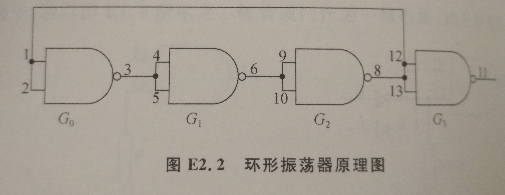
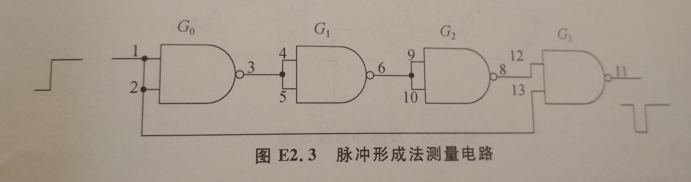
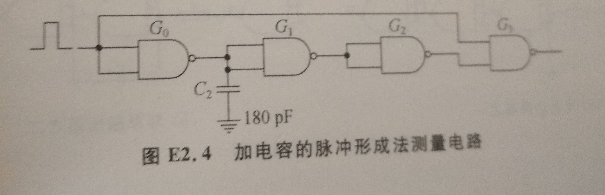
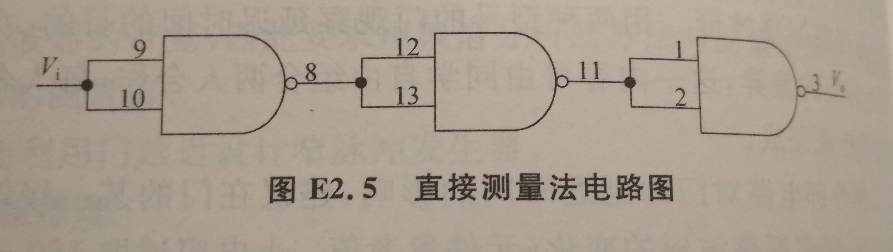
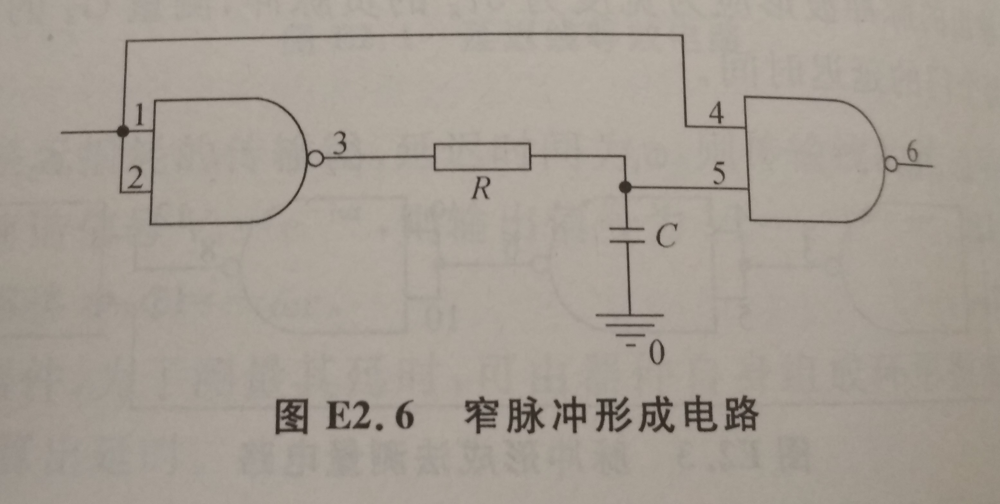
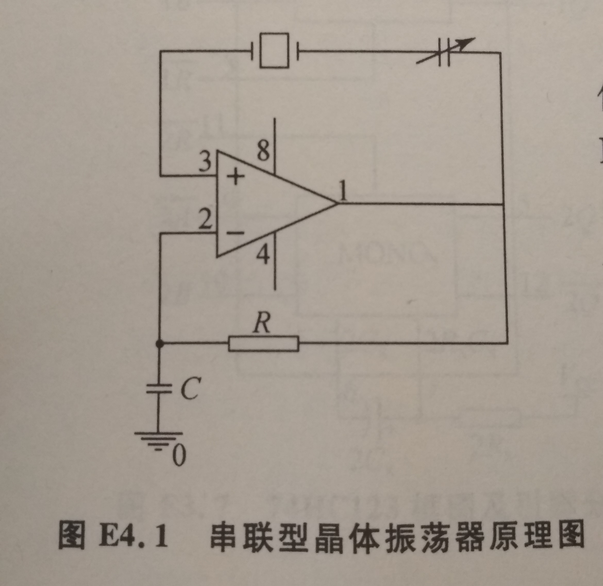
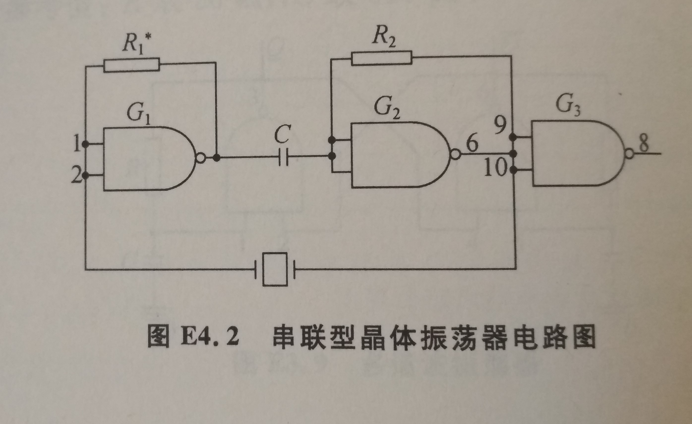
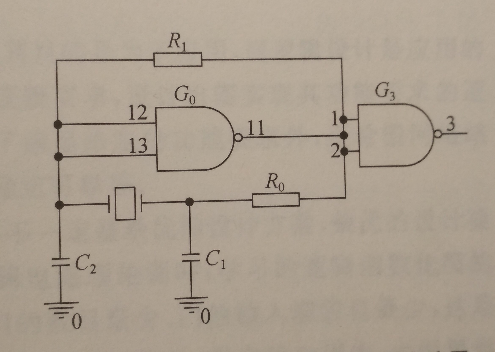

# 逻辑门电路测试之二

 实验人:杨庆龙 学号：1500012956

## 实验目的
1. 了解用环形振荡器法和脉冲形成法测量门的延迟
2. 通过实验理解产生门的延迟时间的机制。由于观察波形的带宽超出了测量仪器示波器的带宽，由此要求用频谱分析的方法对测量结果进行修正，以得到接近实际的测量值
3. 学会利用门延迟实际窄脉冲发生器

## 实验原理
信号的传输是需要时间的，而此处的延迟效应可比拟为延迟线。若延迟线是无损的，则信号经过传输线之后之后有相位上的变化。对应的传递函数是$e^{-j\omega\tau}$，即输出信号会出现一个 $-\omega\tau$的相移。 
对于高速器件，由于其延迟很小，所以无法用直接测量的方法进行测量，而采用由器件自身组成环形振荡器的办法测量其频率，再换出延时。 
使用三个门闭环组成的振荡器，其效果相当于一个反相放大器和三段链连的延迟线组成的线路，若每级门的延迟时间为 $\tau_g$，则三级门则有 $3\tau_g$,信号通过延迟线的相移为 $-3\omega\tau_g$，对于满足相移为 $\pi$的奇数倍的频谱，都满足自激振荡条件。因此，自激振荡的相角条件可表示为: $\phi=-3\omega\tau_g=(2n+1)\pi$。进而可得基频振荡周期为 $T=6\tau_g$ 

## 实验内容
1. 用环形振荡器测量门的延迟时间 
将电路连接为如图所示的情况，观察振荡波形。为了了解外部电路对门的延迟时间的影响，建议在们的某一输出端对地接一个小电容(180pF)，观察波形的变化。

2. 用脉冲形成法测量门的延迟时间 
用三级们作为延迟电路，再用一根导线作为传输通路，将两条通路接到一个与非门上，则输入一个宽脉冲，会在脉冲中形成一个宽为 $3\tau_g$的负脉冲，即可估算每个门的延迟。

要求:(1) 以上均用线性延迟线模型来比拟门的延迟时间，但逻辑门实际是工作在非线性状态，其实际延迟时间会因为状态的不同而不同。
(2)观察电容对传输时间的影响。但电容不能太大，太大的重负载逻辑门带不动的。

3. 直接输入输出法测量门的延迟时间 
对于低速器件，可以将门电路链接，直接输入一个脉冲，再在输出端测量到一个脉冲。比较两者测量时的时间差，即可估算出门的延迟时间。

4. 设计一个窄脉冲形成电路 
如图所示，正确地选择电阻和电容，组成一个产生脉冲宽度为1 $\mu s$的窄脉冲形成电路，对于TTL和CMOS电路，R的取值有较大的差异。

5. 比较两种环形振荡器 
选取相同的R与C，分别观察两种振荡器的波形与频率，并分析这两种电路有何相同之处和不同之处。R=3kΩ，C=330pF。

# 实验四 晶体振荡器
## 实验目的
1. 了解实用的晶体振荡器的组成与调试。
2. 注意观察实验中晶体振荡器的多模现象，判别多模振荡的频率及掌握解决办法
## 实验原理
使用门电路组成的晶体振荡器工作原理与分立元件相同，但此处的逻辑门只作为放大器使用，而且输出阻抗很小。压电晶体的Q值很高，合适作为选频元件。

### 串联谐振
如图所示的电路中，RC是并联负反馈稳定偏置电路，它能使振荡器一软激励建立振荡。为保证选频网络的高Q值，放大电路的输入阻抗不宜过大。

按此原理，得到实际使用的电路图。图中 $G_3$是输出级，R均为并联负反馈偏置电路，使反相器不工作在稳态，即可构成振荡器。($R_1为4.7k\Omega电位器,R_2=2k\Omega,C=0.033\mu F,晶振为4.43MHz$)

### 高Q电感等效
将晶体作为高Q电感，与反向放大器的受控电流源组成三点式振荡器。实际电路如图

(参数选择:$R_1=5-10M\Omega,R_0=2.2k\Omega,C_1=C_2=20pF,晶振频率4.43MHz$)

### 实验内容
1. 组成晶体振荡器并观察器特性
用TTL和HC门各组成一个晶体振荡器，时晶体振荡器振荡与晶体的固有频率。观察隔离门电路前后的振荡波形并测量振荡频率。
2. 观察晶体振荡器的频率稳定度
用示波器观察改变$R_1$对振荡频率的影响，并与信号发生器的进行比较。
### 思考题
