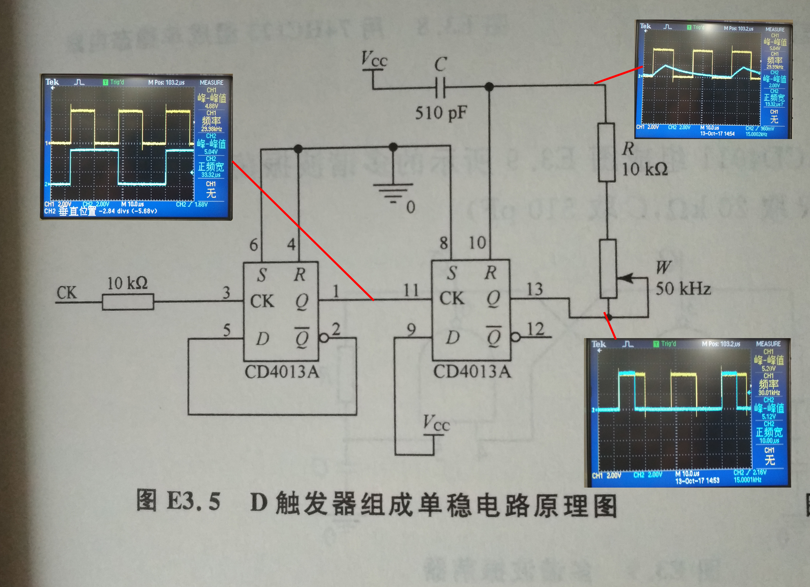
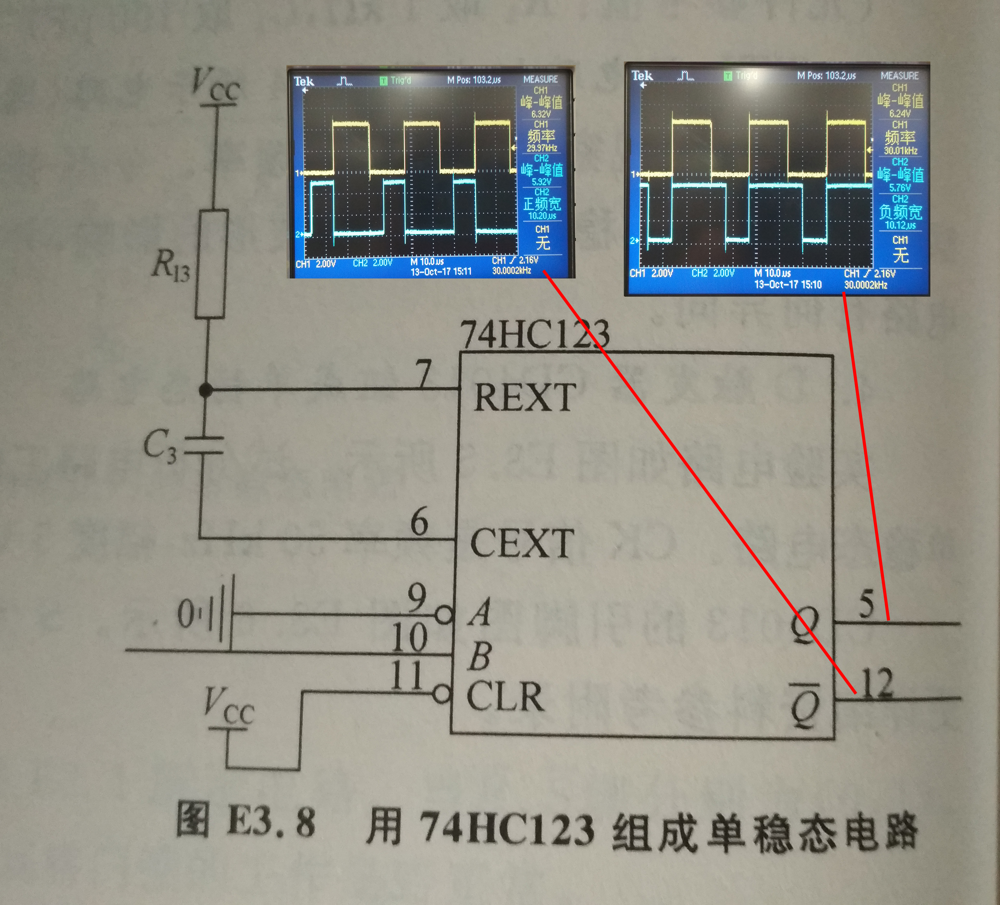

# 单稳态电路与无稳态电路

 实验人:杨庆龙 学号：1500012956

## 实验目的
1. 门电路作为各种逻辑部件的基本组成单元，了解组成单稳态及无稳态电路的逻辑。认识单稳态，双稳态，无稳态三种电路之间的内在联系。
2. 练习用集成们组成单稳态及无稳态电路。
3. 练习用D触发器组成单稳态电路
4. 练习用集成单稳态芯片组成单稳态电路

## 实验原理
### 双稳态电路
两个与非门通过正反馈接在一起，可以构成一个双稳态电路，即为一个SR锁存器。可以通过改变输入信号的组合方式，得到保持的高电平或低电平。
### 单稳态电路
将Set信号的响应信号延迟一段时间，作为Reset信号回到电路自身。即可构成一个可以自动复位，置位，只有一个稳定态的单稳态电路。 
单稳态电路被触发后，需要待延迟电路恢复稳定后，才能触发。否则会因为延迟电路未恢复而导致输出脉冲宽度不稳定。所以需要加禁止电路，使在延迟电路恢复时间内禁止触发信号输入。 
可以用于将输入信号的上升沿采为一个固定宽度的脉冲。该脉冲的宽度即为单稳态电路的暂稳时间长度。
### 无稳态电路
再将Reset的响应信号延迟一段时间返回到Set信号，即可构成一个能自动复位，置位，但不能保持稳定在任一状态的无稳态电路。该电路会不断地在复位和置位之间切换，其宽度与暂稳时间近似，进而可以构成一个周期可以调节的多谐波振荡器。
### 延迟要求
输入信号的变化周期应当大于电路的稳定周期，否则电路可能因为还没有达到稳态而表现出一些我们不想看到的特性。

## 实验仪器和设备
* 双通道示波器：一台
* 信号源：一台
* 双路稳压电源：一台
* 电烙铁：一台
* 74LS00，与非门：两片
* CD4011，与非门：两片
* CD4013，D触发器:一片
* 74HC123,集成单稳芯片:一片

## 实验内容
1. 用阻容延迟电路组成单稳态及无稳态电路 
（1）	按图E3-2用74LS00组成单稳态电路，观察并记录各点信号波形。延迟时间按照1 $\mu$ s计算，选择合适的暂稳时间，观察输出脉冲宽度，并通过观察 $\hat{R},\hat{s},Q,\hat{Q}$ 等端点的波形，检查电路是否正常工作。 

（选做）用双脉冲信号作为触发，观察变化，调节双脉冲的时间间隔，观察对单稳态电路的稳定性的影响。 
（2）	按图E3-3用74LS00组成无稳态电路，观察并记录各点信号波形，可用一个二极管代替电阻R，$\hat{R}$ 不直接送入B端，而是用三极管及电阻组成跟随器，使得 $\hat{R}$ 端电平低于输入下阈值电压，再送入B端。 

（3）	按图E3-9用CD4011多谐波振荡器，观察并记录各点信号波形， $R=20k\Omega,C=510pF$  

（选做）改变其中一边的延迟值，观察现象并定性分析； 
2. 按图E3-5用D触发器CD4013组成单稳态电路，观察并记录主要信号波形，该单稳态电路的暂稳时间为10 $\mu s$。CK输入信号频率 $50k\Omega$ ，幅度5V 

3. （选做）按图E3-8用集成单稳芯片74HC123组成单稳态电路，观察并记录主要信号波形。暂稳时间1微妙，$C_3=510pF,R_13=47k\Omega$ 

## 实验结果
全过程工作电压为4.78V
1. 门电路单稳态电路 
实验所用元件数据：$R=2k/Omega,C=510pF,R_1=1k\Omega,C_1=100pF$ 
(1) 输入频率为100kHz的方波，观察电路各点波形。
###### 单稳态电路方波输入各点信号波形图

其中，黄颜色为输入信号。 
从图中可以看到，输入的方波经过第一级电路后，变成很窄的负脉冲。该脉冲使得后级单稳态电路从输出低电平的状态转为输出高电平的状态。又经过RC电路的延迟作用后，输出的高电平信号又被输入到Reset端，使得电路又回到输出低电平的稳态。 
从该过程可以看到，电路输出高电平脉冲的宽度很大程度上是由RC电路的延迟长短决定的。这也就给了我们在调节单稳态电路的暂稳时间方面一些依据。
(2) 输入500kHz的双脉冲方波，观察电路各点波形

容易看到，对于前级电路，$R_1与C_1$的值比较小，所以提高信号频率后并没有太大变化。但对于后级电路，我们可以看到对于第一个方波，电路的表现和输入低频方波时差不多。 
但由于第二个方波输入时该电路还没有从暂稳态中恢复。虽然此时电路的输出已经又回到低电平状态，但从Gate3的5端可以看到，由于C的值比较大，所以此时电容电压远远不到高电平状态。若此时输入一个脉冲，电容电压又一次降低，但由于起始变化时的电压比高电平状态低，所以只花了更少的时间就达到了使得输出电压发生变化的阈值，进而导致第二个脉冲比第一个脉冲窄。 
还可以看到，第二级电路的输出电压很快地就从0升高到3V多但不足4V的状态，而又花了很长的时间才恢复到4V多的水平。初步猜测认为是对于74LS00门电路，为了降低功耗同时又不至于损失太多速度，就选择使用两段输出功率的设计。即，用大功率输出级将输出电压快速地从低电平提高到高电平的阈值电压，到达阈值电压后又换用小功率的输出极缓慢地提高输出电压。
2. D触发器单稳态电路 
输入频率为30kHz的方波信号，观察电路各点波形
###### D触发器单稳态电路各点信号波形图

图中黄颜色为输入信号。 
从图中可以看到，第一个触发器的主要作用为二分频与隔离。又可以看到，当第二个D触发器输出高电平时，会缓慢地给电容充电，当电容的电压大于阈值电压后，第二个触发器就会被复位，又一次输出低电平。这就实现了一个单稳态电路。 
从分析中可以看到，我们可以通过改变电阻的大小，进而改变电容充电的速度，进而调节该电路的暂态时间。当电路输出的脉冲宽度为$10\mu s$时，电位器的阻值大小为$30.2k\Omega$。
3. 74HC123单稳态集成芯片 
输入频率为30kHz的方波信号，观察电路各点波形
###### 74HC123单稳态电路各点信号波形图

图中黄色信号为输入信号。 
对于该电路的分析与D触发器相类似，就不再赘述了。为了输出宽度为$10=\mu s$的脉冲，电位器的阻值为$30.5k\Omega$。
4. 无稳电路(二)
###### 无稳电路各点波形图

图中黄色信号为Q端输出信号。 
先进行理论分析，当电容被充电至高电平的输入阈值，门电路输出低电平，进而导致电容又开始放电。当电容放电至低电平的输入阈值时，门电路又输出高电平，电容又开始充电。 
从图中也可以看到，左右两边的RC电路均在阈值附近反复地充放电。因此，可以得知，该电路的振荡频率很大程度上是由RC电路的值决定的。
5. 无稳电路(一)
使用CD4011搭建无稳电路，选取的元件值为$R=10k/Omega,C=510pF$ 
###### 无稳电路各点波形图

图中黄色信号为Q端输出信号。 
虽然新加入了一个隔离用的门电路，但理论分析与4中相同，就不再进行赘述。 
## 思考题
1. 比较本实验中的多谐波振荡器与实验二中的环形振荡器，两者有什么相同之处?有何不同之处? 
答：两个振荡器本质上均为利用正反馈电路的反馈特性，周期性地改变电路的状态，进而实现振荡。 
不同点，环形振荡器的频率由门电路本身的延迟时间决定，这就导致了我们几乎不能控制电路的振荡频率。结果就是速度很快，但几乎不可控。而多谐波振荡器是由RC电路决定振荡的频率，虽然速度慢一些，但我们可以通过调节RC电路的元件数值，实现对电路振荡频率的调整。
2. 如何用一个集成单稳态芯片组成一个无稳态电路?提出设计方案。 
答：只需要在单稳态芯片的基础上构建一条反馈回路，即可实现无稳态电路。以74HC123具体操作为，将$\hat{Q}$通过一个RC电路接回到B端，即可实现一个无稳态电路，其振荡频率由RC电路的元件数值决定。
## 讨论
1. 当示波器或信号发生器的同轴电缆没有完全扣稳时，可以等效为电路中接入了一个比较大的电容。又由于我们所用的信号频率都比较高，所以该电容不会对信号的幅度产生非常大的影响。但是，信号的相位却会发生很大的变化，这就导致我们观察到的信号由于不同频率的相移而变形，影响我们的观察。因此，当观察到的信号与设想结果有较大不同时，可以考虑检查同轴电缆是否扣紧，从而减小电容对频率分量相移的影响。
2. 对于实验5中电路，若将隔离门的另外一个管脚悬空，则会导致该管脚处于不定态。进而表现为该门电路的输出发生剧烈抖动，无法观察到高质量的信号波形。但又由于噪声是随机的，所以使用平均采样的方式可以在很大程度上改善观察图像的质量。然而最好的方法还是不让管脚悬空，接上高电平。
