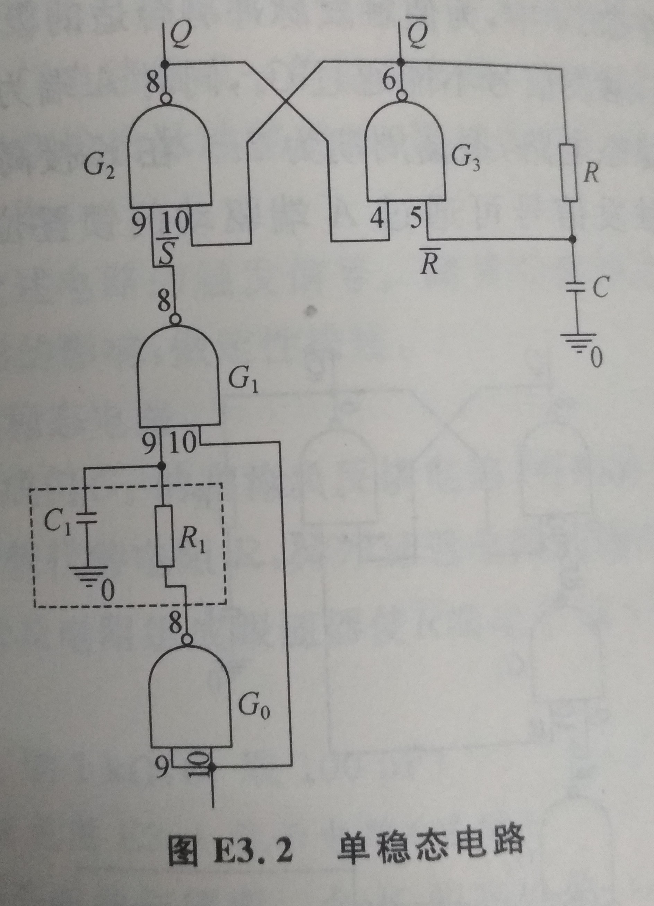
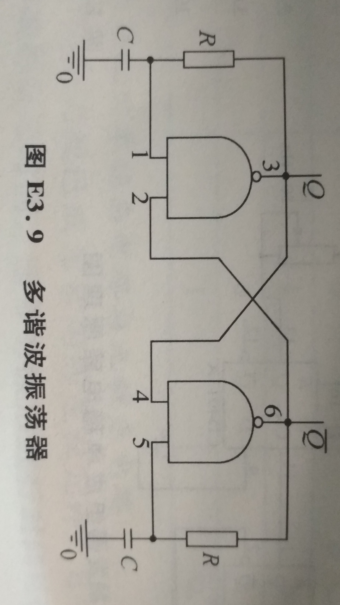
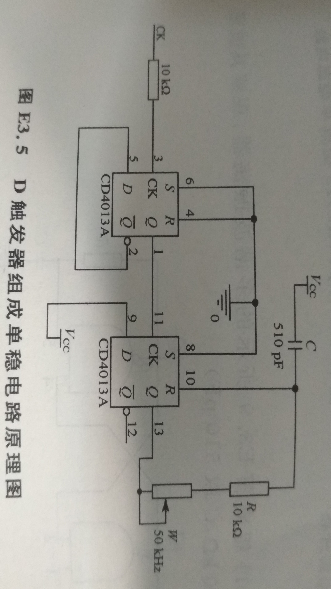
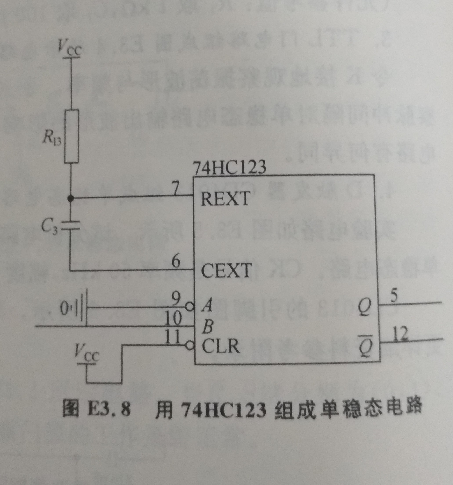

# 单稳态电路与无稳态电路

 实验人:杨庆龙 学号：1500012956

## 实验目的
1. 门电路作为各种逻辑部件的基本组成单元，了解组成单稳态及无稳态电路的逻辑。认识单稳态，双稳态，无稳态三种电路之间的内在联系。
2. 练习用集成们组成单稳态及无稳态电路。
3. 练习用D触发器组成单稳态电路
4. 练习用集成单稳态芯片组成单稳态电路

## 实验原理
### 双稳态电路
两个与非门通过正反馈接在一起，可以构成一个双稳态电路，即为一个SR锁存器。可以通过改变输入信号的组合方式，得到保持的高电平或低电平。
### 单稳态电路
将Set信号的响应信号延迟一段时间，作为Reset信号回到电路自身。即可构成一个可以自动复位，置位，只有一个稳定态的单稳态电路。 
单稳态电路被触发后，需要待延迟电路恢复稳定后，才能触发。否则会因为延迟电路未恢复而导致输出脉冲宽度不稳定。所以需要加禁止电路，使在延迟电路恢复时间内禁止触发信号输入。 
可以用于将输入信号的上升沿采为一个固定宽度的脉冲。该脉冲的宽度即为单稳态电路的暂稳时间长度。
### 无稳态电路
再将Reset的响应信号延迟一段时间返回到Set信号，即可构成一个能自动复位，置位，但不能保持稳定在任一状态的无稳态电路。该电路会不断地在复位和置位之间切换，其宽度与暂稳时间近似，进而可以构成一个周期可以调节的多谐波振荡器。
### 延迟要求
输入信号的变化周期应当大于电路的稳定周期，否则电路可能因为还没有达到稳态而表现出一些我们不想看到的特性。

## 实验仪器和设备
* 双通道示波器：一台
* 信号源：一台
* 双路稳压电源：一台
* 电烙铁：一台
* 74LS00，与非门：两片
* CD4011，与非门：两片
* CD4013，D触发器:一片
* 74HC123,集成单稳芯片:一片

## 实验内容
1. 用阻容延迟电路组成单稳态及无稳态电路 
（1）	按图E3-2用74LS00组成单稳态电路，观察并记录各点信号波形。延迟时间按照1 $\mu$ s计算，选择合适的暂稳时间，观察输出脉冲宽度，并通过观察 $\hat{R},\hat{s},Q,\hat{Q}$ 等端点的波形，检查电路是否正常工作。 

（选做）用双脉冲信号作为触发，观察变化，调节双脉冲的时间间隔，观察对单稳态电路的稳定性的影响。 
（2）	按图E3-3用74LS00组成无稳态电路，观察并记录各点信号波形，可用一个二极管代替电阻R，$\hat{R}$ 不直接送入B端，而是用三极管及电阻组成跟随器，使得 $\hat{R}$ 端电平低于输入下阈值电压，再送入B端。 

（3）	按图E3-9用CD4011多谐波振荡器，观察并记录各点信号波形， $R=20k\Omega,C=510pF$  

（选做）改变其中一边的延迟值，观察现象并定性分析； 
2. 按图E3-5用D触发器CD4013组成单稳态电路，观察并记录主要信号波形，该单稳态电路的暂稳时间为10 $\mu s$。CK输入信号频率 $50k\Omega$ ，幅度5V 

3. （选做）按图E3-8用集成单稳芯片74HC123组成单稳态电路，观察并记录主要信号波形。暂稳时间1微妙，$C_3=510pF,R_13=47k\Omega$ 

## 实验结果
## 思考题
## 讨论
