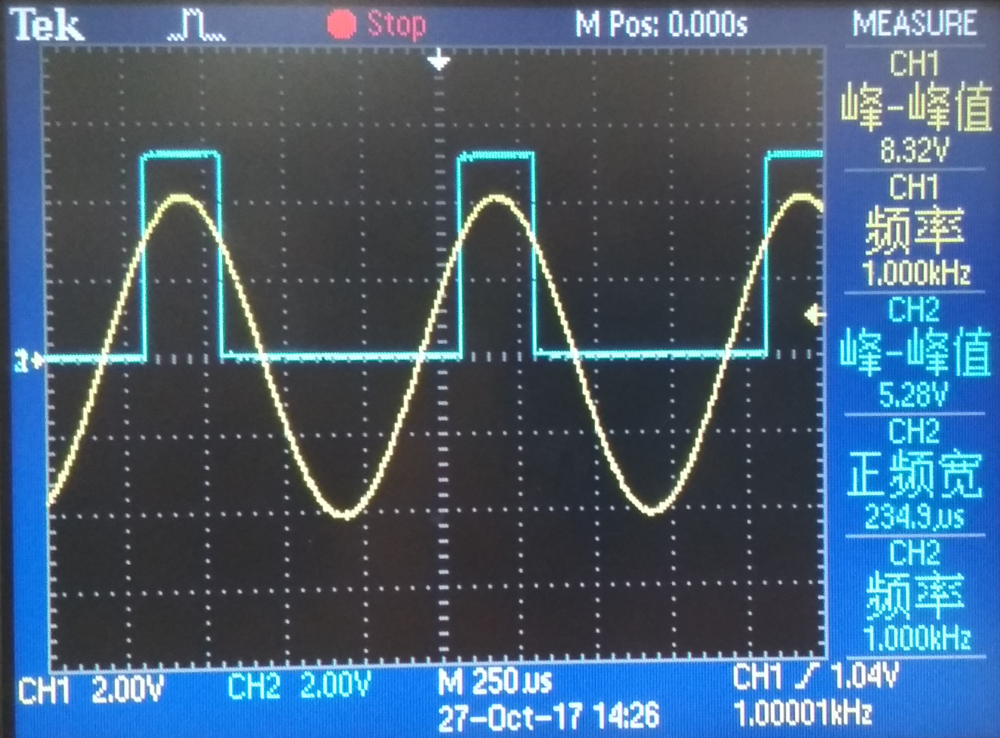
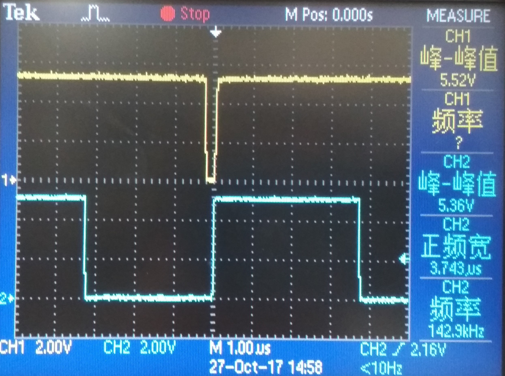
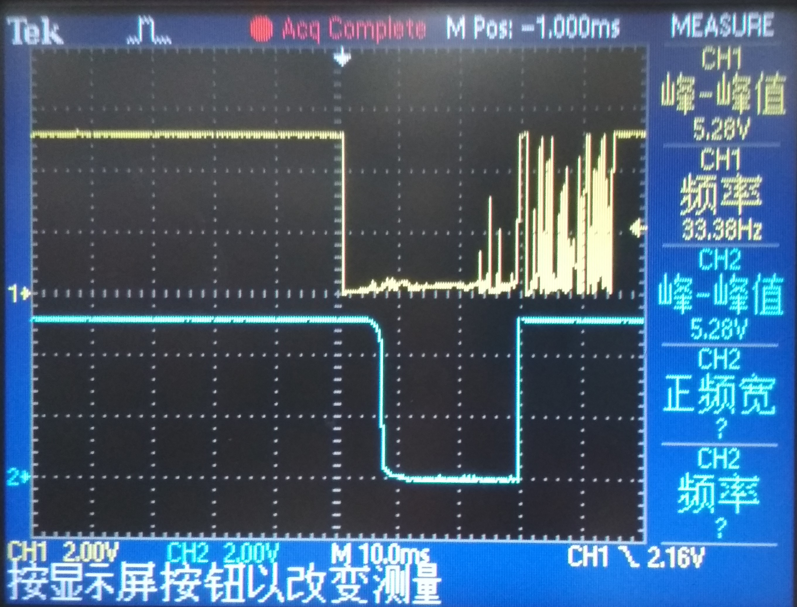
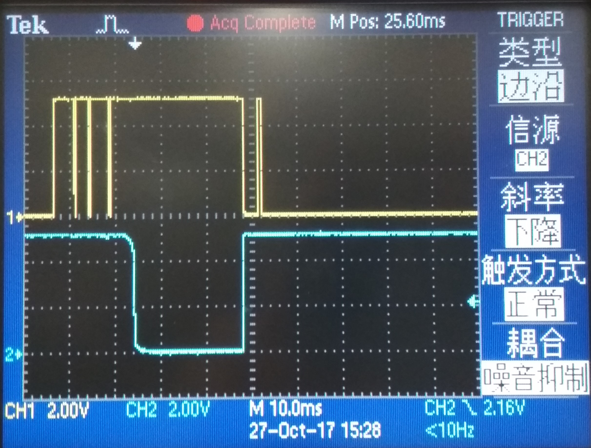
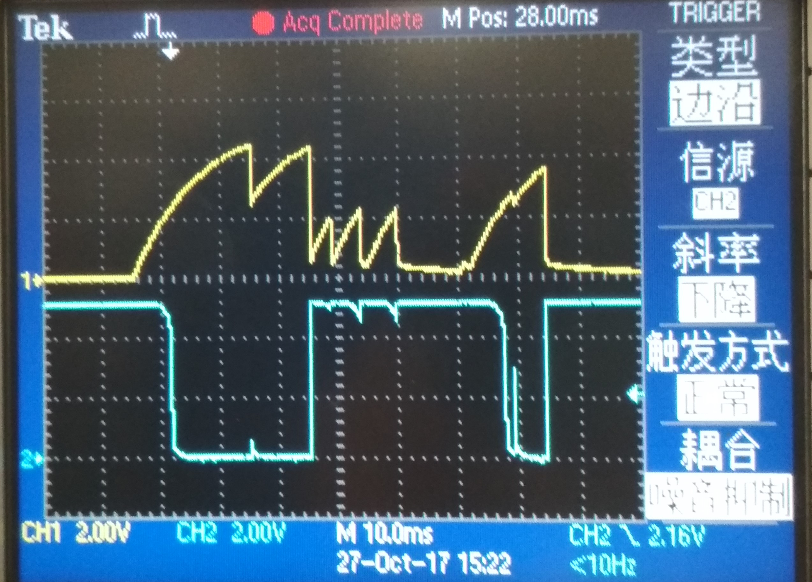

# 实验六 计数器和脉宽测量
## 实验目的
1. 通过学习典型可逆计数器和简单脉宽测量电路的原理来熟悉一些小中规模结构的数字集成芯片的原理和使用
2. 掌握计数电路，初步掌握脉宽测量技术的设计和调试方法
3. 初步认识具有一定功能的电路系统，掌握看图分析的方法
4. 预计可能得到的现象，观察并分析实际结果
## 实验原理
计数器分为很多种，可以按照进制，计数方向，控制端进行不同的分类。但其基本工作过程都是记录一段时间内，电路输入了多少个时钟上升沿或下降沿。 
脉宽测量，其原理为仅在脉冲时间内让计数器工作，进而通过计数器的计数值与时钟频率计算出脉宽。显然，测量精度与时钟频率直接相关。但在实际过程中需要注意，脉宽可能会超出计数器计数上限，导致溢出的发生。
## 实验内容
1. 调试电路 
以信号发生器为时钟源，输出正弦波，调试时钟整形，分别调试两路计数显示电路。
2. 设计加减计数器 
选用1kHz的时钟信号，测量并记录各点波形，注意观察各个触发器和计数器在不同沿到来使得响应。
* 十进制加计数器:将UP/DOWN端置于UP即可
* 七进制减计数器:将JP开关设置为0111，再将UP/DOWN端置于DOWN，再将CO端通过一个反相器和RC延迟电路接回到PE端即可。
3. 设计实现两路计数器级联的100进制连续加减计数器，输入低频时钟信号，观察数码管现实，并注意溢出指示。 
将前一级计时器的CO端接到后一级的CI端，并将两个门电路的UP/DOWN端接到一起，即可实现一个100进制的计数器。
4. 设计脉宽测量仪 
将时钟周期设置为10ms，接入3中设计的100进制计数器，并将消抖电路的输出接到前级电路的CI端，即可通过数码管示数得到脉宽。
5. 脉冲整形电路 
在输入三角波或正弦波的情况下观察脉冲整形电路的输入输出特点，解释原因。后面的非门除了使用4069外，还可使用40106，请比较两种门的异同。

## 实验仪器和设备
* 双通道示波器：一台
* 信号源：一台
* 双路稳压电源：一台
* 实验用PCB板

## 实验结果
1. 向该电路输入正弦波，观察整形电路各点波形如图。
###### 三极管输入基极

由于有二极管的存在，输入信号的负半周被滤去，这就防止了输入负电压的情况。
###### 第一个非门输出信号

经过前级整形后的信号被再次非门整形，波形向方波靠拢，但由于输入信号有较大的一部分处在高低阈值电压之间，所以输出的方波边缘比较弯曲，并不够理想。
###### 第二个非门输出信号

经过第二个非门的处理，信号已经非常接近方波了。但实际上电路还是会出现不少毛刺，导致实际计数的时候变化并不是连续的，而是会出现连跳两次的情况，所以在实际计数时，直接输入方波信号，以获得比较好的计数效果。
2. 设计加减计数器
###### 十进制加法计数器波形图

从上到下分别为，时钟信号，$Q_0$,$Q_1$,$Q_2$,$Q_3$，由于PE端接地，所以并没有在图中给出 
首先从图中可以得到，$Q_3$的一个周期需要10个CLK信号，满足十进制计数器的基本要求。又看输出端的波形可以得到，输出数字变化为0000，0001，0010，0011，0100，0101，0110，0111，1000，1001，0000，即为一个从0到9的循环。
###### 七进制减法计数器波形图
该电路的 $P_3$端被置为0，其他位都被置为1，U/D端置为低电平，又将CO通过一个反相器接回到PE端。

从上到下分别为$CLK$.$Q_0$,$Q_1$,$Q_2$。从图中可以看到，进过七个时钟周期后，$Q_2$走完一个周期。进而可得，该七进制计数器满足进制要求。又可以看到电路的输出数字为111,110,101,100,011,010,001,111。 
###### CO端输出波形图

而实际上，电路会在000状态停留一小段时间后才跳到111状态，将输入信号频率提高到1MHz后，可以看到CO端会输出一个很小的负脉冲，若计数频率不大，该脉冲和电路在000状态停留的时间可以忽略。
3. 设计实现两路计数器级联的100进制连续加计数器，输入低频时钟信号，观察数码管现实，并注意溢出指示。 
低位到达9的时候，LED_CO1亮，但是由于4511芯片有延迟，所以观察起来就是在LED从8的末尾开始亮，在9的末尾熄灭。对于LED_CO2也有一样的现象。 
每次低位从9变为0时，高位加一。又有，在99的后半周，LED_CD亮，而且除非Reset，否则不会熄灭。 
由于LED_CO会在D触发器的clk端输入上升沿时被点亮，又由于只有两个计数器均从9到0时才会出现上升沿，也就才会将LED灯点亮。
4. 脉宽测量仪与整形电路 
脉宽测量仪的设计思路为，对3中100进制计数器选用合适的时钟周期，再将按键接到计数器的使能端上，通过计数低电平出现个数就可以估算出按键脉冲的时长。 
###### 消抖电路a点与e点波形图

通道1为a点，通道2为e点。从图中可以看到a点信号有很多由于机械原因导致的尖刺，若将这些尖刺直接输入电路，会导致计数器不能很好地工作，所以需要整形电路。
###### 消抖电路b点与e点波形图

经过非门的整形后，波形的尖刺明显少了很多，但还是有不少脉冲，这些脉冲也会影响计数器的正常工作，所以还需要进一步的处理。
###### 消抖电路c点与e点波形图

由于有二极管的存在，电路表现出非对称性，即电压上升得很慢，但下降得很快，方便后级处理。
###### 消抖电路d点与e点波形图

由于c点与d点之间只有小电阻进行隔离，所以起始差别不是很大。
###### 时钟与e点波形图

计数器会在使能端为低电平的前提下，在clk上升沿计数一次。观察该波形图可以看到，满足条件的一共有6个上升沿，计数器计数为6。但实际上不难观察到，实际按键时长是长于60ms的，所以并不准确。而提高时钟频率则是一种不错的改善精度的方法，但也并不能从根本上消除误差。
## 思考题
1. 减计数器:将计数器的P端设置为所需要的进制数，U/D端设置为低电平，再将CO2，CO1通过一个或非门接回到两个计数器的PE端即可。 
加计数器：将计数器的P端设置为100-进制数，U/D端设置为高电平，再将CO2,CO1通过一个或非门接回两个计数器的PE端即可
## 实验数据

