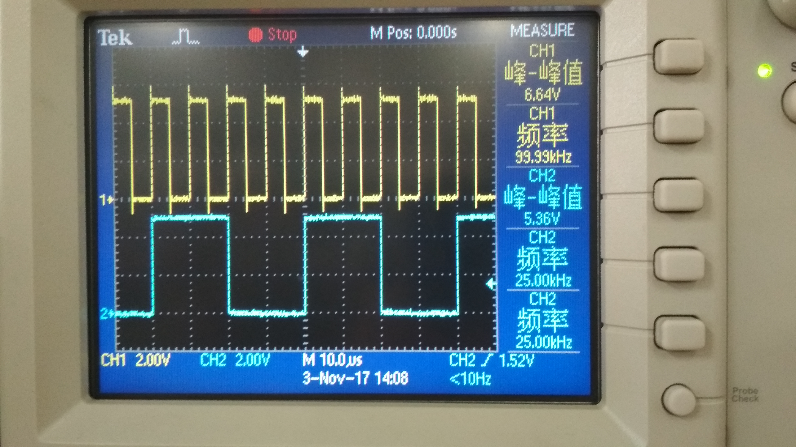

# 实验七 同步时序系统设计 测试实验报告

实验人:杨庆龙 学号:1500012956 提交日期:2017.11.8 

## 实验目的
1. 了解各模块的工作流程，加深对实验系统的理解。
2. 了解各模块在不同状态下的输入输出，方便后续的系统搭建与调试。
## 实验原理
1. 时钟子模块电路 
本子模块主要由一片双二进制加计数器CD4520,一片八反相器CD4069及若干电阻组成。
* CD4520:每个计数器都有R,CLK,EN三个输入端;R为高电平时Q输出低电平，EN是使能端，CLK为时钟输入。
* CD4069:用于时钟信号的缓冲和整形
2. 显示及手控开关子模块电路 
本模块主要有两个部分，手控开关和译码锁存显示电路。
* 手控开关:有四个手控钮子开关模拟输入
* 译码锁存显示电路:由两片CD4511,两个七段阴极半导体发光管构成
3. 接收数据并技术子模块 
该模块由双向三态门74HC244，数据锁存器CD4042和二进制可阈值减计数器CD4526构成。
* 74HC244:内部有两组独立的4位三态门，主控端为 $\bar{G}$，G有效时，输出端同输入端一致，否则为高阻态
* CD4042:由CLK和POLARITY决定输出态，电平一致时，Q与D相同，否则Q锁存
* CD4526:P为预值输入端，PE为写入端，MR为手动复位端，CLK为时钟，INH为时钟约束信号，CF为进位输出允许信号
4. 进制转换模块电路 
该电路由两片十进制加计数器74HC160,两片三态门74HC244构成
* 74HC160:可以异步清零，置数加载方式为同步，ENT和ENP均为高电平时，计数器在CLK上升沿计数，ENT还用于进位信号的输出
* 76HC244:此处的三态门均接在总线上，所以 $\bar{ODA_1}$ 和 $\bar{ODA_2}$ 不可同时为低电平有效
## 实验内容
子模块路测试： 
（1） 基本时钟子模块电路中CD4520计数器的计数、清零和使能功能，记录必要的信号波形关系及现象； 
（2） 显示子模块电路中用/CL2和/CL3控制端测试CD4511锁存译码驱动器及数码管显示，记录必要的信号波形关系及现象； 
（3） 接收数据及计数子模块电路中CD4526是否可以正常输出“O”信号，记录必要的信号波形关系及现象； 
（4） 数据二-十进制转换子模块电路中74HC160的计数输出，记录必要的信号波形关系及现象； 
## 实验结果
1. 时钟模块 
时钟模块的主要作用为输出不同频率的方波，方便控制电路进行相应的操作。所以只要各个输出工作在正常状态即可。若使能信号无效，则计数器不工作，该计数器的使能端是正常的。以下波形中CH1均为信号源的输出信号。
###### $Q_0$波形图

从图中可以看到，$Q_0$端的输出为输入信号二分频后的结果，与设想中相同。该计数器正常工作。
###### $Q_1$波形图

从图中可以看到，$Q_1$端的输出也是输入信号二分频后的结果，该计数器的第零位正常工作。
###### $Q_2$波形图

该端口为四分频后的结果，满足对计数器第一位的要求。
###### $Q_3$波形图

该端口为八分频后的结果，满足对计数器第二位的要求。 
又将 $Q_3$ 端接到R端，若R端正常，则计数器的$Q_3$端应当输出周期为输入信号八倍的窄脉冲。
###### $Q_3$波形图

可以看到，该端口输出的的确为输入信号周期八倍的窄脉冲，满足要求。该计数器正常工作。
2. 显示子模块 
现实子模块在相应端口为低电平时会将总线上的数据读入，并将其显示到相应的数码管上。将$CL_2$和$CL_3$置为低电平，拨动开关，观察数码管的变化可得。输入数据为0到9的数字时，数码管能正常显示数据，而对于超过9的数字则没有数字输出。
3. 接收数据及计数子模块电路 
将$Q_z$端接回到PE端，则计数器每次溢出后即可自动复位，实现输出周期信号的要求。又将$\bar{ODB_2}$置为低电平，该模块的输入三态门处于导通状态，又将信号源输入的方波接到$CL_1$端，让D触发器能够及时锁存总线上的数字。拨动开关为k，计数器的$Q_z$端应该输出周期性的方波，其周期为输入信号的k倍。
###### 拨码为5时的$Q_z$波形

的确输出了周期为输入信号5倍的脉冲。
###### 拨码为
