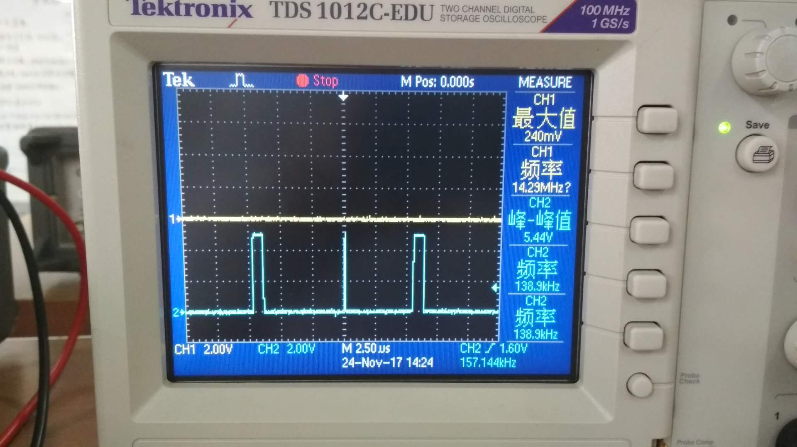
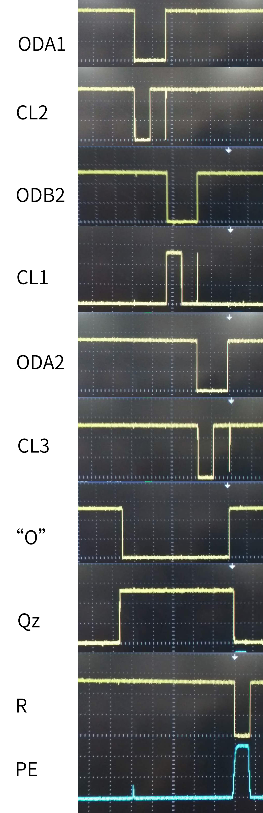
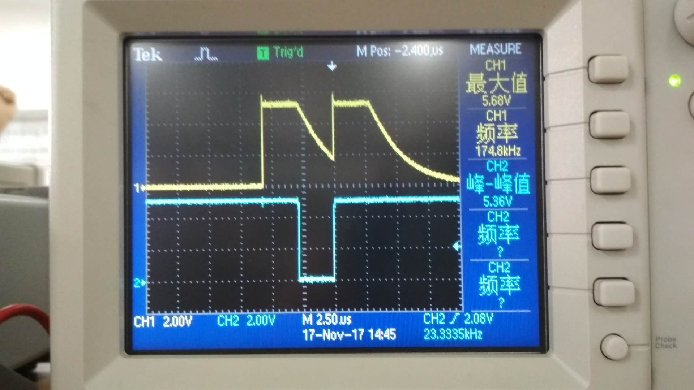

# 实验七 同步时序系统设计 实验报告

实验人:杨庆龙 学号:1500012956 提交日期:2017.11 

## 实验结果
### 时序设计
从功能要求可知，该电路应该有以下几个大的阶段
1. 数码管个位示数
2. 数码管十位示数
3. 减计数器置数
4. 复位
5. 等待计数

其中，前三个阶段都需要在上升沿或下降沿才能将总线上的数据读入。因此，考虑使用两个状态将三态门打开，再使用一个状态产生方波，将数据读入。因此，正好可以把加计数器的八个态都用上。又考虑到若使用000态作为等待状态，则需要占据两个态的功能就无法用卡诺图进行化简，因此，最终考虑使用111态作为等待状态，其他的阶段就可以用卡诺图进行化简，避免冒险。
###### 状态-功能说明表
|状态|功能|
|---|:---|
|111|等待状态|
|000|个位计数三态门打开 个位数码管低电平|
|001|个位计数三态门打开 个位数码管恢复高电平，实现上升沿锁存|
|010|减计数器三态门打开 D触发器输入高电平|
|011|减计数器三态门打开 D触发器输入低电平，实现下降沿锁存|
|100|十位计数三态门打开 十位数码管低电平|
|101|十位计数三态门打开 十位数码管高电平，实现上升沿锁存|
|110|160计数器复位，减计数器置数|

为了防止出现输入为9，输出为19的问题，使用减计数器的$Q_z$端控制160的输入时钟。又为了保证系统只会在减计数器计数时停在111态，所以$EN_2$将同时由$Q_1,Q_2,Q_3,Q_z$控制。

进而可以得到相应的逻辑表达式
|控制信号|逻辑表达式|
|---|:---:|
|$ODA_1$|$Q_2+Q_3$|
|$CL_2$|$ODA_1+Q_1$|
|$ODA_2$|$Q_2+\overline{Q_3}$|
|$CL_3$|$ODA_2+Q_1$|
|$ODB_2$|$Q_3+\overline{Q_2}$|
|$CL_1$|$\overline{ODB_2+Q_1}$|
|$"O"$|$\overline{Q_z}$|
|$PE$|$\overline{\overline{Q_3}+\overline{Q_2}+Q_1}$|
|$R$|$\overline{PE}$|
|$EN_2$|$\overline{Q_1}+\overline{Q_2}+\overline{Q_3}+Q_z$|

### 实际调试
#### 电路不工作:示数保持为0
按照逻辑设计，焊接电路后，出现问题，不论拨码是多少，最终的示数均为00。使用示波器查看不同点的波形后，得到结论。计数器从111(等待态)到000(个位三态门打开)的过程中，会经过110(160计数器复位)，导致最终锁存的数字均为0。 

解决方法为在PE端接上一个电容，将由于冒险产生的脉冲消除掉，但又不能对正常的PE信号造成很严重的影响。经过测试，使用330pF的电容效果较好。
#### 电路正常工作
接入电容解决示数保持为0的问题后，电路正常工作，各点波形如图
###### 电路各点波形

可以看到，电路已经正常工作，但其能够工作的最大频率仅为664kHz，需要进一步地优化。

### 电路优化
#### 电路不工作:部分情况下数字只能增大不能减小
将输入信号频率调高，出现信号数字只能增大不能减小的问题。观察各点波形后发现，在总线上可以看到由于个位输出的三态门在减计数器锁存数据之前，又由于拨码开关电路的输出能力太弱，所以其不能在一个周期内将总线从高电平降至低电平，导致数字只能增大不能减小。
###### 总线驱动不足波形图

#### 解决方法
由于拨码开关的驱动能力不能更改，所以考虑将其放置于个位置数功能之前。让其有足够的时间输出让总线数据稳定。由于之前的电路设计都比较简单，所以，只需将$ODB_2$和$ODA_1$互换即可。 
改进之后，该电路的工作频率提高到2.236MHz，得到了极大的提升。

#### 电路不工作:示数不再发生变化
当电路的工作频率过高之后，电路的示数不再变化，观察各点波形后发现，电路在110态在111态之间反复。经过分析后认为，是电路从110态到111态后$EN_2$信号无效，但又由于$EN_2$信号对$t_{setup}$ 和 $t_{hold}$ 的要求较高，使得电路不能稳定在111态，就又返回110态，110态又使得减计数器被置位，到了下一个时钟也重复。
#### 解决方法
由于认为问题是$EN_2$的长度不够导致的，所以考虑将$EN_2$有效的时间延长。最后决定使用一个峰值检测电路在$EN_2$从低到高影响不大的情况下，延长其从高到低的时间。经过计算，选择用100pF的电容和1kΩ的电阻。 
经过改进后电路的工作频率提高到2.42MHz，但又出现了新问题。

#### 电路不工作:示数只会为1或0
加入峰值检测电路后，电路在输入为0的情况下为0，否则均为1。观察各点波形发现，$EN_2$信号一直有效，不受$Q_z$控制，所以160只能最多计数一个周期，导致示数最多只为1。而$EN_2$一直为有效的原因就是选择的电容电阻值不当，将$EN_2$的有效时间延长了太多。
#### 解决方法
考虑使用更小的电阻或更小的电容，而电阻太小会使得$EN_2$与地之间的隔离变弱，进而导致$EN_2$又很难达到一个较高的电平，所以考虑选择换电容。又由于时间不够，所以并没有实际操作，结果未知。

### 实验数据

