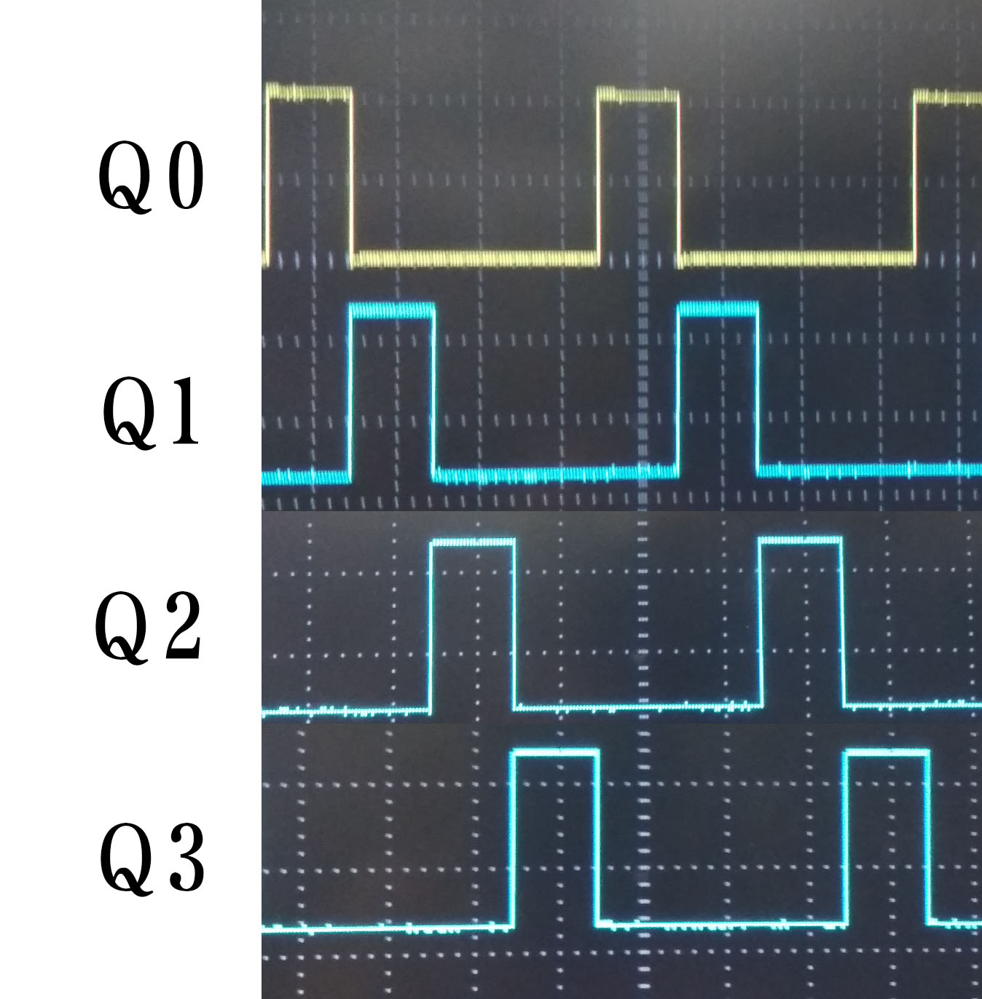
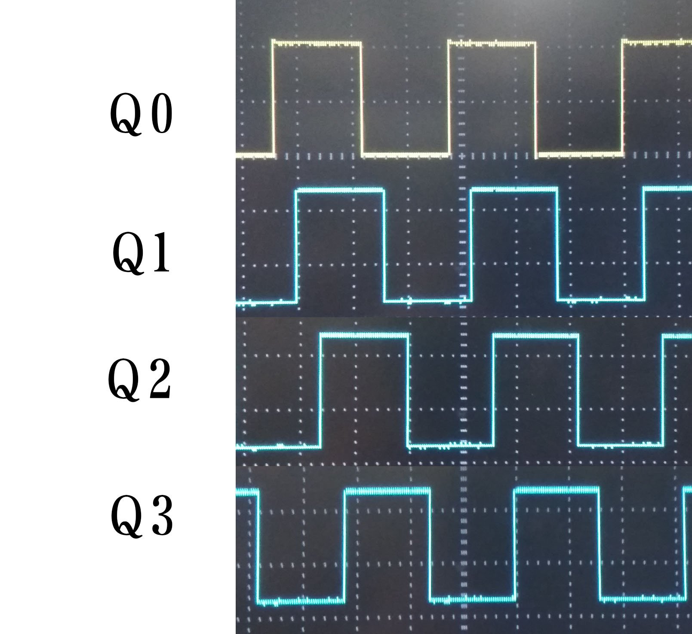
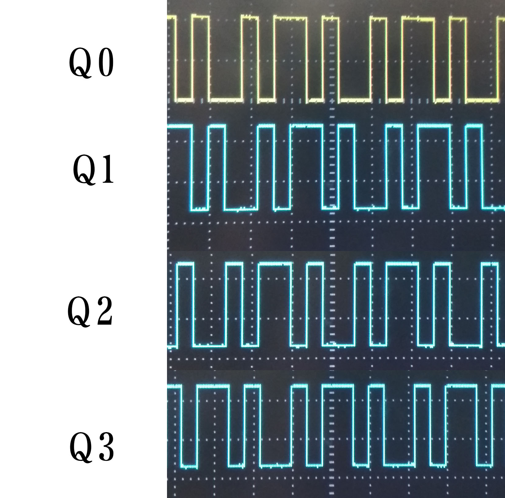
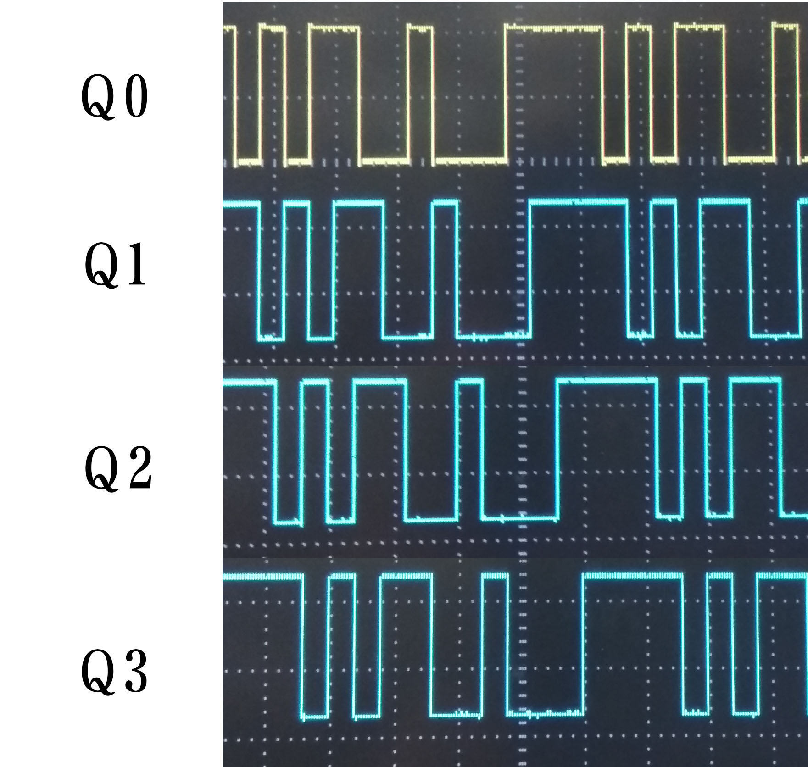
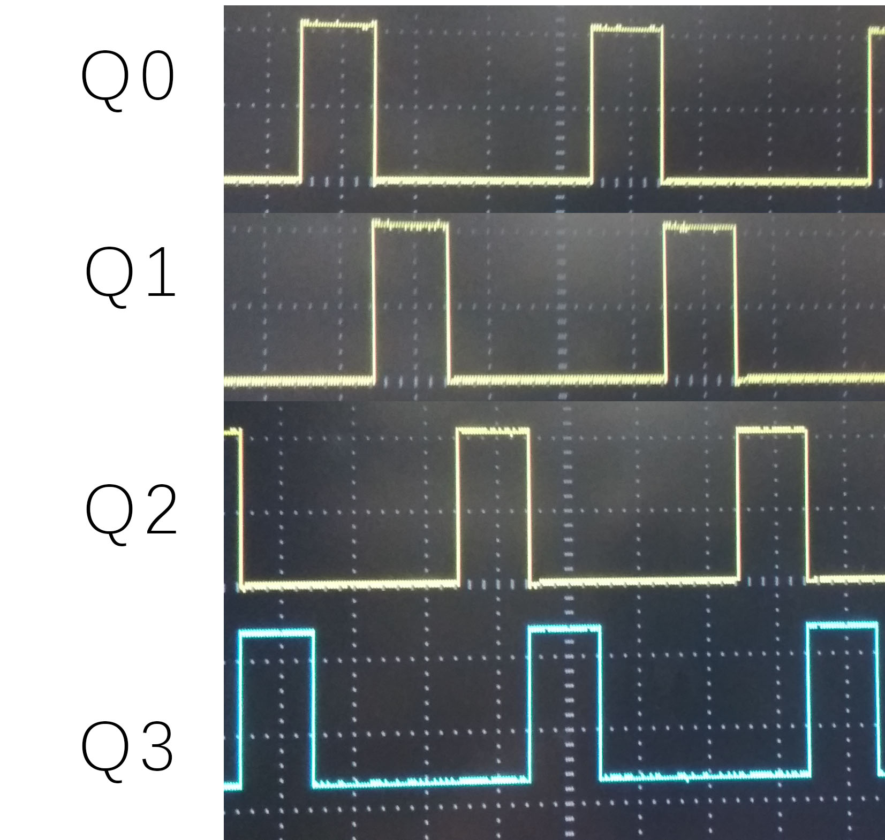
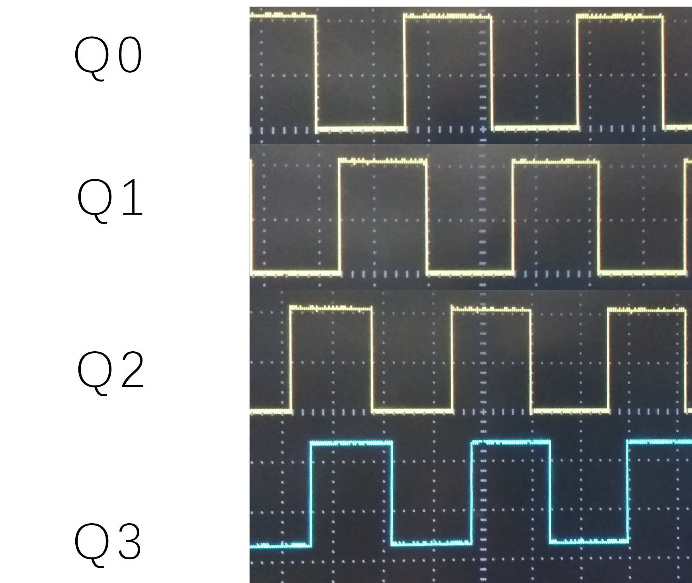
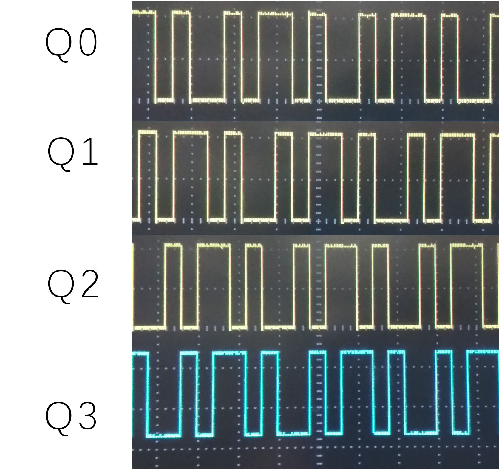
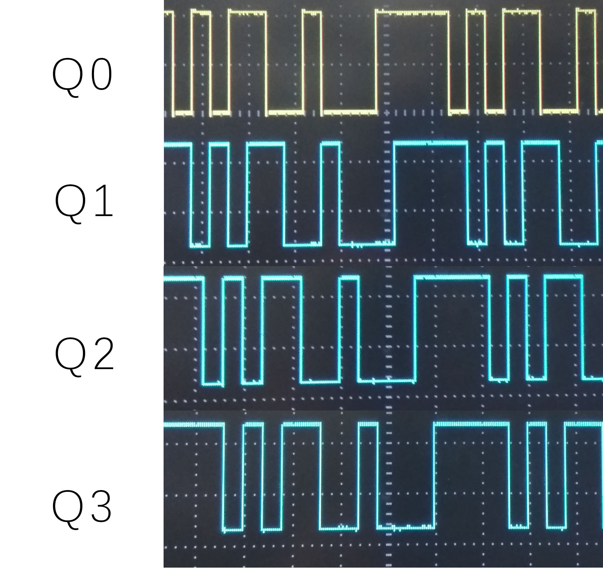
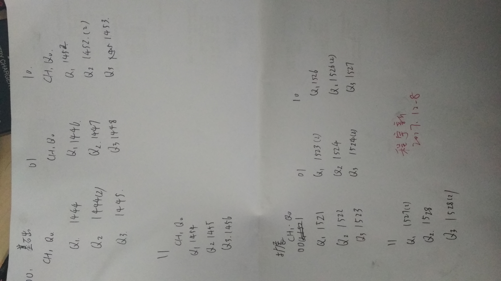

# 实验九 程序控制反馈移位寄存器
<div style="text-align:center">实验人:杨庆龙<br/>学号:1500012956<br/>提交时间:2017.12.12</div>

## 实验目的
1. 了解程序控制反馈移位寄存器的工作原理
2. 掌握带自启动的反馈移位寄存器电路的设计方法
3. 学习可编程逻辑器件GAL的应用
## 实验原理
### 系统构成框架<br/>
该系统有串行移位寄存器和组合逻辑电路组成。由串行移位寄存器实现状态的改变，再用组合逻辑电路反馈下一状态的输入信号，利用组合逻辑组成不同码型的反馈移位寄存器。
### 码序列与反馈电路电路的逻辑函数<br/>
#### 码型1
从码型1的状态转换图得到设计真值表
###### 移位寄存器码型1反馈逻辑函数设计真值表
|$Q_3Q_2Q_1Q_0$|$D_0$|$Q_3Q_2Q_1Q_0$|$D_0$|
|---|---|---|---|
|0|x|8|1|
|1|0|9|x|
|2|0|10|x|
|3|x|11|x|
|4|0|12|x|
|5|x|13|x|
|6|x|14|x|
|7|x|15|x|

###### 移位寄存器码型1反馈逻辑函数卡诺图
|$Q_1Q_0/Q_3Q_2$|00|01|11|10|
|---|---|---|---|---|
|00|x|0|x|1|
|01|0|x|x|x|
|11|x|x|x|x|
|10|0|x|x|x|

化简得表达式$D_0=\overline{Q_0+Q_1+Q_2}$
###### 移位寄存器码型1的状态转移图


#### 码型2

###### 移位寄存器码型2反馈逻辑函数设计真值表
|$Q_3Q_2Q_1Q_0$|$D_0$|$Q_3Q_2Q_1Q_0$|$D_0$|
|---|---|---|---|
|0|1|8|0|
|1|1|9|x|
|2|x|10|x|
|3|1|11|x|
|4|x|12|0|
|5|x|13|x|
|6|x|14|0|
|7|1|15|0|


###### 移位寄存器码型2反馈逻辑函数卡诺图
|$Q_1Q_0$/$Q_3Q_2$|00|01|11|10|
|---|---|---|---|---|
|00|1|x|0|0|
|01|1|x|x|x|
|11|1|1|0|x|
|10|x|x|0|x|

表达式$D_0=\overline{Q_3}$
###### 移位寄存器码型2状态转移图

从图中可以看到，该状态图共有两个循环态，不能保证电路工作在我们想要的循环上，所以需要再加一项让电路能最终回到我们想要的循环。
表达式$D_0=\overline{Q_3}+Q_3\overline{Q_2}\overline{Q_1}Q_0$
###### 意味寄存器码型2状态转移图

加上一项后，可以看到电路能够工作在我们想要的状态，逻辑成立
#### 码型3
###### 移位寄存器码型3反馈逻辑函数设计真值表
|$Q_3Q_2Q_1Q_0$|$D_0$|$Q_3Q_2Q_1Q_0$|$D_0$|
|---|---|---|---|
|0|x|8|x|
|1|x|9|0|
|2|1|10|0|
|3|x|11|0|
|4|1|12|x|
|5|1|13|0|
|6|1|14|x|
|7|x|15|x|

###### 移位寄存器码型3反馈逻辑函数卡诺图
|$Q_1Q_0$/$Q_3Q_2$|00|01|11|10|
|---|---|---|---|---|
|00|x|1|x|x|
|01|1|1|0|0|
|11|x|x|x|0|
|10|x|1|x|0|

表达式$D_0=\overline{Q_3}$

###### 移位寄存器码型3状态转移图

可以看到，该电路状态有着码型2相同的问题，考虑增加一项

表达式$D_0=\overline{Q_3}+Q_3Q_2\overline{Q_1Q_0}$
###### 移位寄存器码型3状态转移图


#### 码型4
###### 移位寄存器码型4反馈逻辑函数设计真值表
|$Q_3Q_2Q_1Q_0$|$D_0$|$Q_3Q_2Q_1Q_0$|$D_0$|
|---|---|---|---|
|0|x|8|1|
|1|1|9|0|
|2|0|10|1|
|3|1|11|0|
|4|0|12|1|
|5|1|13|0|
|6|0|14|1|
|7|1|15|0|

###### 移位寄存器码型4反馈逻辑函数卡诺图
|$Q_1Q_0$/$Q_3Q_2$|00|01|11|10|
|---|---|---|---|---|
|00|x|0|1|1|
|01|1|1|0|0|
|11|1|1|0|0|
|10|1|0|1|1|

表达式$D=\overline{Q_3}Q_0+Q_3\overline{Q_0}+\overline{Q_3Q_2Q_1q_0}$
###### 移位寄存器码型4状态转移图


### 电路结构
电路上方为通过按键开关实现电路工作状态切换的状态控制电路。<br/>左下方为时钟整形电路，用于增强输入时钟的驱动能力。

## 实验内容
### 设计电路
从之前的分析中可以得到，该电路的逻辑表达式为
|模式|表达式|
|---|---|
|00|$D=\overline{Q_0+Q_1+Q_2}$|
|01|$D=\overline{Q_3}+Q_3\overline{Q_2}\overline{Q_1}Q_0$|
|10|$D=\overline{Q_3}+Q_3Q_2\overline{Q_1Q_0}$|
|11|$D=\overline{Q_3}Q_0+Q_3\overline{Q_0}+\overline{Q_3Q_2Q_1q_0}$|

### 检查各部分电路
检查实验板的GAL外围电路如时钟整形，程序计数器和LED状态表示电路能否正常工作，认清各部分和控制连续及其输入关系

### 编译及调试
1. 编译设计好的程序，并将程序烧录到芯片中
2. 将GAL插到电路板上，观察波形是否符合要求

## 实验结果
### 基础功能
在GAL的代码中，将不同状态的逻辑表达式与相应的状态使用与逻辑进行连接，并在时钟上升沿改变状态，即可实现所需要的功能。将电路按照课本所给电路图焊接完毕，再将烧录好的芯片插上板子，测量可得波形图如下，其中每幅图从上到下的波形依次为 $Q_0,Q_1,Q_2,Q_3$ 。
###### 基础功能00模式波形图

###### 基础功能01模式波形图

###### 基础功能10模式波形图

###### 基础功能11模式波形图

从波形图中可以看到，该电路符合基本功能的要求，能实现相应模式下的码型循环。
### 拓展功能
拓展功能中需要将状态改变电路，即两位二进制加法器也写入GAL器件中。又由于如果按照异步电路设计，触发器模块就需要接入两个时钟信号，分别控制加法器和基础功能模块，但GAL只能有一个时钟信号。所以考虑设计为同步电路，使用一个触发器记录前一个时钟上升沿到来时button端的高低电平，再与当前button端的电平进行比较，当满足button电压从低到高时，计数器加一，即可实现状态转移。测量不同情况下的电路输出可得，其中每幅图从上到下的波形依次为 $Q_0,Q_1,Q_2,Q_3$
###### 拓展功能00模式波形图

###### 拓展功能01模式波形图

###### 拓展功能10模式波形图

###### 拓展功能11模式波形图

可以看到，拓展功能的GAL芯片功能也符合要求，也能实现相应状态下的码型循环，并将输入脚压缩至clk和button两个脚，方便焊接。

## 讨论
1. 对于同一功能的芯片，如果选择了不同的封装，就会导致芯片不能工作在我们想要的状态下。具体表现为输出输入引脚与约束文件不符，而且输出逻辑混乱，不能测到有规律的波形变化。
2. 由于电路板已经被使用多次，所以大部分焊盘都被焊接过许多次，并有大量焊锡残留。在焊接时，难免出现焊盘和焊盘被焊锡连在一起的情况，这就会导致部分焊盘的电压不能按照我们所设计的到达逻辑高电平或逻辑低电平。因此，在上电之前必须检查个焊盘是否独立，特别是芯片的输出管脚，避免损坏芯片，影响实验的进行。
## 实验数据

## 源码
### 基础功能源码
```
module top(
    input clk,
    input [1:0] C,
    output [3:0] Q
    );
    reg [3:0]Q;

    wire D;
    wire [3:0]inD;
    wire [1:0]tempC;
    wire [3:0]tempQ;

    always@(posedge clk)
    begin
        Q[3:0]<=tempQ[3:0];
    end

    assign inD[0]=~(Q[0]|Q[1]|Q[2]);
    assign inD[1]=~(Q[3])|(Q[3]&~Q[2]&~Q[1]&Q[0]);
    assign inD[2]=~(Q[3])|(Q[3]&Q[2]&~Q[1]&~Q[0]);
    assign inD[3]=(Q[0]^Q[3])|(~Q[0]&~Q[1]&~Q[2]&~Q[3]);
    assign D=(inD[0]&~C[0]&~C[1])|(inD[1]&C[0]&~C[1])|(inD[2]&~C[0]&C[1])|(inD[3]&C[0]&C[1]);

    assign tempQ[0]=D;
    assign tempQ[1]=Q[0];
    assign tempQ[2]=Q[1];
    assign tempQ[3]=Q[2];

    endmodule

```

### 拓展功能源码
```
module top(
    input clk,
    input button,
    output [1:0] C,
    output [3:0] Q
    );
    reg [3:0]Q;
    reg [1:0]C;
    reg before;

    always@(posedge clk)
    begin
        if(~before&button)
	         begin
	          C[0]<=~C[0];
	           if((C[1]&~C[0])|(~C[1]&C[0]))
	            C[1]<=1;
	           else
	            C[1]<=0;
	         end
	      Q[0]<=((~Q[1]&~Q[2]&~(Q[0]&~Q[3]))&(~C[0]&~C[1]))|((~Q[3]&~(Q[2]&Q[1]&~Q[0]))&(C[0]&~C[1]))|((~Q[3]&~(~Q[2]&Q[1]&Q[0]))&(~C[0]&C[1])) |(((Q[0]&~Q[3])|(Q[3]&~Q[0])|(~Q[0]&~Q[1]&~Q[2]&~Q[3]))&(C[0]&C[1]));
	      Q[1]<=Q[0];
	      Q[2]<=Q[1];
	      Q[3]<=Q[2];
        before<=button;
    end
endmodule

```
