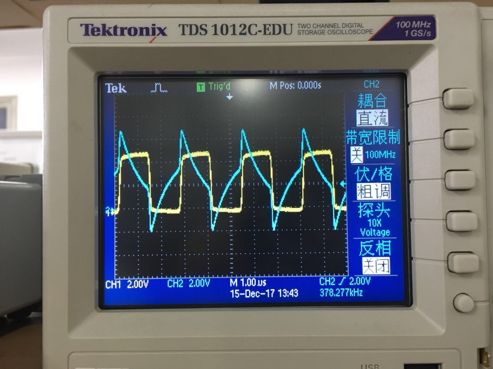

# 实验十二 模数和数模转换

实验人:杨庆龙 学号:1500012956

## 实验目的
1. 了解模数转换芯片和数模转换芯片的性能和工作时序
2. 了解数模和模数转换电路的接口方法，主要保证时序正确，消除竞争
3. 了解一些常用芯片的使用方法
4. 看到较复杂的电路图
## 实验仪器和设备
* 双通道示波器：一台
* 信号源：一台
* 双路稳压电源：一台
* 模数转换芯片ADC0809
* 数模转换芯片DAC0832
* 三态门74HC125
* 八D锁存器74HC573
* 八缓冲器74HC541
* 双4位二进制同步加法计数器CD4520
* 可预置4位减计数器CD4526
* 双单稳态多频振荡器CD4528

## 实验原理
该电路主要分为数模转换，模数转换和状态控制三大部分电路
### 模数转换
模数转换芯片为ADC0809，输出电压范围0-2.55V
###### ADC0809引脚说明表
|引脚|功能|
|---|---|
|$in_0-in_7$|8路模拟信号输入口|
|$D_0-D_7$|8位数字量化结果输出口|
|START，ALE|START为启动控制口 ALE为地址锁存口|
|EOC，OE|EOC为转换结束脉冲输出口 OE为输出允许控制端|
|$V_{ref}$|决定量化台阶电压|
|ADD-A/B/C|三位地址选择端|
|CLK|时钟输入端|
###### 电路说明
|引脚|功能|
|---|---|
|$in_0$|基准电压的分压信号|
|$in_1$|D/A部分的输出口|
|$in_2$|外部信号经过放大，平移后的信号|
|$in_3$|接地|
|ADD-A/B|地址选择端口|
#### 时序
将ALE和START信号连在一起由控制电路控制，转换完成后由EOC输出到控制电路产生OE脉冲，在通过两个非门的延迟在结果被锁存后再输出。
### 数模转换
数模转换芯片为DAC0832，输出信号为电流，进过转换后的电压大小应与ADC的输入电压吻合，为0-2.55V
###### DAC0832引脚说明
|引脚|功能|
|---|---|
|$in_0-in_7$|数据输入管脚|
|ILE|数据允许锁存信号，高电平有效|
|CS|片选信号，低电平有效|
|XFER|数据传送信号|
|$V_{ref}$|基准电源输入|
|$R_{fb}$|反馈信号|
|IOUT|两端口和为常数，随DAC寄存器线性变化|
|AGND，DGND|模拟地，数字地|
### 状态控制
可用单片机或逻辑电路控制整个电路的工作状态
## 实验内容
### 基本调试及检测
1. 调节$W_1$改变基准电压，使基准电压为2.55V
2. 用示波器测量时钟部分各点的波形
### 模数转换检测
1. 手动单次测量。$S_4$断开，$S_6$接通，按动$S_7$进行单次模数转换。用$S_1,S_2$选择输入通道，调节电压，观察发光二极管的变化，并与万用表测量结果进行比较。
2. 连续测量。将$S_4,S_6$断开，改变$S_3,S_5$观察CK的频率变化，使其周期约为1s，改变输入电压，延迟自动转换输出结果。分别测量START,EOC,OE，各点波形
3. 用$S_1,S_2$选择外部输入电压。输入一个0.5Hz的锯齿波，调节电位器$W_4$，使得转换的模拟信号在0-2.55V的范围内。
### 数模转换验证
1. 手动单次测量。开关设置同模数转换1，用万用表观察输出信号与二极管示数一致。
2. 连续转换。开关设置同模数转换2，用示波器观察输出波形，改变开关$S_5$观察输出波形，比较转换速度快与慢。
3. 用$S_1,S_2$设置输入为模数转换的输出，观察输入输出是否一直。
4. 测量整个电路所需要的电流。
### 单片机控制
1. 将仿真器连接到实验板上，$S_4$开关接通，是控制信号线与仿真器相连。
2. 在PC机上将软件写入单片机
3. 观察结果
## 实验结果
### 基本调试
1. 调整$W_1$,使得基准电压为2.5503V。
2. 时钟电路波形测量如下
###### B点波形图

因为有电容的存在，B点的波形相对于A点已经平缓了很多，但用来作为时钟信号明显不行
###### C点波形图

经过反门的作用后，时钟信号从B点的近似为锯齿波变成了方波，可以使用。
### 模数转换检测
1. 手动单次测量
###### 手动单次测量数据记录表
|万用表测量结果/V|二极管示数|十进制示数|
|---|---|---|
|1.9213|11000001|193|
|1.7968|10110100|180|

ADC示数均为相应电压向上取整的结果，满足要求。

2. 连续测量
###### 连续测量数据记录表
|万用表测量结果/V|二极管示数|十进制示数|
|---|---|---|
|1.7825|10110011|179|
|1.6084|10100001|161|
|1.5021|10011001|153|

ADC示数均为相应电压向上取整的结果，满足要求。 提高工作频率，测量各点波形可得
###### 电路波形图

其中CH1为EOC信号，可以看到由于非门的延时作用，START信号比EOC信号慢了一点点，保证了Tsetup和Thold。又由于OE信号为反馈产生，所以只有一个小脉冲。

3. 输入幅度为0-1V，symm=100%的锯齿波。可以观察到ADC模块的输出为一个逐渐增大，后又突然减小，再重复增大的循环，与输入电压的变化相同。

### 数模转换检测
1. 单次测量
###### 手动单次测量数据记录表
|万用表测量结果/V|二极管示数|十进制示数|
|---|---|---|
|0.22290|00010111|23|
|0.55490|00111000|56|

万用表测量结果与二极管示数相同，DAC模块工作正常。

2. 连续转换
###### 较快速度地输出

###### 较慢速度地输出

从图中可以看到，该DA芯片输出电压的范围由基准电压决定，而变化频率则由加法器的变化频率决定。

3. 将DAC模块的输出接到ADC模块上，再将系统的工作频率降到1Hz左右，可以观察到ADC模块的示数比DAC慢一拍，但示数相同。

4. 将正电源的保险丝撤下，换成调到电流档的万用表，可以观察到在电路工作时电流表示数在不断变化。在工作频率较高时，电流表示数为37-56mA，将频率降低至约1Hz时，电流表示数为26-45mA。

## 实验数据

