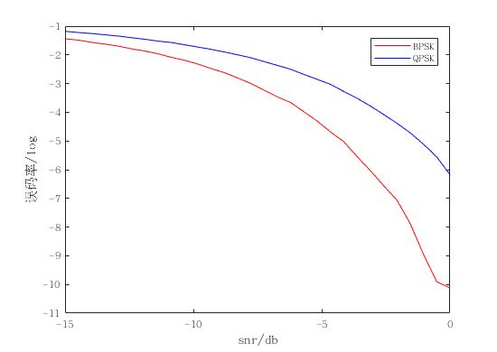

# 通信原理大作业报告

杨庆龙 1500012956

## BPSK/QPSK误码率分析
经过matlab仿真后可以得到如图所示的曲线
###### BPSK/QPSK误码率曲线

从图中可以看到，在相同的信噪比下，QPSK的误码率总是大于BPSK。初步分析认为，因为QPSK需要将传送信息的能量分散到cos方向和sin方向上，所以在相同的信噪比下，QPSK受到的影响更到大。 
又能看到，误码率会随着信噪比的上升而减小，因为噪音越大传递的信息就越容易出错，所以误码率会随着信噪比的上升而减小。
## 升余弦滤波匹配
进行matlab仿真后得到如图的曲线
###### BPSK升余弦滤波匹配

从图中可以看到，经过升余弦滤波匹配后，相同信噪比下误码率明显下降，甚至与理论值也相差极小。又因为调制后的信号带宽已经超出了信道带宽，所以在经过升余弦滤波时，反而会因为滚降系数较小而损失相对较少的信息，进而使得误码率并不如想象中的随滚降系数增大而减小。
###### QPSK升余弦滤波匹配

从图中能得到和BPSK一样的结论。但又综合上第一问中得到的结果，QPSK的误码率在相同的信噪比下误码率还是比BPSK的要大。
## 两种信道的采样点星座图
###### 采样点星座图

从图中可以看到，经过非带限信道后，采样点星座图在xy两个方向分布都比较均匀，呈现出二维高斯分布的特征。但经过带限信道后，一方面因为信号间的串扰导致采样点变得更加分散了。此外，又由于匹配滤波和带限信道的双重作用导致噪声不再为白色噪声，进而导致在x方向和y方向不再相同，出现有色噪声的特点。

## 时域均衡
因为原本的BPSK几乎没有什么符号间干扰，所以我在代码中人为引入了一定的符号间干扰。得到的结果如图
###### 不同 $f_1$ 下的误码率曲线

###### 不同抽头数目下的误码率曲线

从图中可以看到，对于一定的符号间干扰，需要挑选正确的系数，否则得到的结果很不理想。特别是像系数为0.9的均衡器会引起很严重的其他抽头的干扰，进而导致结果非常不理想。而其他的比如系数为0.5或0.2的均衡器就能在将能量集中起来的同时又不会引入其他很严重的干扰，效果还可以。此外，还可以看到，对于不同的均衡器，其在噪声很大的情况下都不能正常工作，都会有非常高的误码率，所以ZF均衡器抗噪声的能力很糟糕，而抽头数目不够也只会引入更多的符号间干扰。而且，只用增加几个抽头就能极大地改善符号间的干扰，并最终达到一个不错效果。
